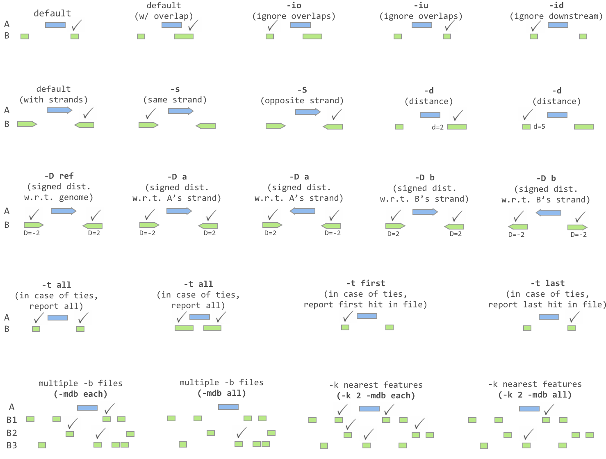

.. _closest:

###############
*closest*
###############

Similar to :doc:`../tools/intersect`, `closest` searches for overlapping features in A and B. In the event that
no feature in B overlaps the current feature in A, `closest` will report the nearest (that is, least
genomic distance from the start or end of A) feature in B. For example, one might want to find which
is the closest gene to a significant GWAS polymorphism. Note that `closest` will report an
overlapping feature as the closest---that is, it does not restrict to closest *non-overlapping* feature. The following iconic "cheatsheet" summarizes the functionality available through the various options provided by the `closest` tool.

|

|

.. note::

    ``bedtools closest`` requires that all input files are presorted data by chromosome and
    then by start position (e.g., ``sort -k1,1 -k2,2n in.bed > in.sorted.bed``
    for BED files).

.. note::

    Reports "none" for chrom and "-1" for all other fields when a feature
    is not found in B on the same chromosome as the feature in A.
    E.g. `none -1  -1`

.. important::

    As of version 2.22.0, the `closest` tool can accept multiple files for
    the `-b` option. This allows one to identify the closest intervals between a single
    query (`-a`) file and multiple database files (`-b`) at once! This functionality
    now requires that all input files be sorted by chromosome and start coordinate
    in an identical manner (e.g., `sort -k1,1 -k2,2n`).

===============================
Usage and option summary
===============================
**Usage**:
::

  bedtools closest [OPTIONS] -a <FILE> \
                             -b <FILE1, FILE2, ..., FILEN>

**(or)**:
::

  closestBed [OPTIONS] -a <FILE> \
                       -b <FILE1, FILE2, ..., FILEN>
  

  
===========================      ===============================================================================================================================================================================================================
Option                           Description
===========================      ===============================================================================================================================================================================================================
**-s**                           Require same strandedness.  That is, find the closest feature in B that overlaps A on the _same_ strand. By default, overlaps are reported without respect to strand.

**-S**                           Require opposite strandedness.  That is, find the closest feature in B that overlaps A on the _opposite_ strand. By default, overlaps are reported without respect to strand.

**-d**                           In addition to the closest feature in B, report its distance to A as an extra column. The reported distance for overlapping features will be 0.

**-D**                           | Like `-d`, report the closest feature in B, and its distance to A as an extra column. However unlike `-d`, use negative distances to report upstream features.
                                 | The options for defining which orientation is "upstream" are:
                                 | - `ref`   Report distance with respect to the reference genome.
                                 |           B features with a lower (start, stop) are upstream
                                 | - `a`     Report distance with respect to A.
                                 |           When A is on the - strand, "upstream" means B has a
                                 |           higher (start,stop).
                                 | - `b`     Report distance with respect to B.
                                 |           When B is on the - strand, "upstream" means A has a
                                 |           higher (start,stop).
**-io**                          Ignore features in B that overlap A. That is, we want close, yet not touching features only.

**-iu**                          Ignore features in B that are upstream of features in A. This option requires -D and follows its orientation rules for determining what is "upstream".

**-id**                          Ignore features in B that are downstream of features in A. This option requires -D and follows its orientation rules for determining what is "downstream".

**-fu**                          Choose first from features in B that are upstream of features in A.
                                 This option requires -D and follows its orientation rules for determining what is "upstream".

**-fd**                          Choose first from features in B that are downstream of features in A.
                                 This option requires -D and follows its orientation rules for determining what is "downstream".

**-t**                           | Specify how ties for closest feature should be handled.  This occurs when two features in B have exactly the same "closeness" with A. By default, all such features in B are reported.
                                 | Here are all the options:
                                 | - `all`    Report all ties (default).
                                 | - `first`  Report the first tie that occurred in the B file.
                                 | - `last`   Report the last tie that occurred in the B file.

**-mdb**                         | Specify how multiple databases should be resolved.
                                 | - `each`  Report closest records for each database (default).
                                 | - `all`   Report closest records among all databases.

**-k**                           Report the k closest hits. Default is 1. If tieMode = "all", all ties will still be reported.

**-names**                       When using *multiple databases* (`-b`), provide an alias for each that will appear instead of a fileId when also printing the DB record.

**-filenames**                   When using *multiple databases* (`-b`), show each complete filename instead of a fileId when also printing the DB record.

**-N**                           Require that the query and the closest hit have different names. For BED, the 4th column is compared.

**-header**                      Print the header from the A file prior to results.
===========================      ===============================================================================================================================================================================================================

==========================================================================
Default behavior
==========================================================================
The `closest` tool first searches for features in B that overlap a feature in A. If overlaps are found, each feature in B that overlaps A is reported. If no overlaps are found, `closestBed` looks for
the feature in B that is *closest* (that is, least genomic distance to the start or end of A) to A. For example, 

For example, consider the case where one of the intervals in B overlaps the interval in B, yet another does not:

.. code-block:: bash

  $ cat a.bed
  chr1  10  20  a1  1 -

  $ cat b.bed
  chr1  7   8   b1  1 -
  chr1  15  25  b2  2 +

  $ bedtools closest -a a.bed -b b.bed
  chr1  10  20  a1  1 - chr1  15  25  b2  2 +

Now compare what happens when neither interval in B overlaps the record in A, yet one is closer than the other.

.. code-block:: bash

  $ cat a.bed
  chr1  10  20  a1  1 -

  $ cat b.bed
  chr1  7   8   b1  1 -
  chr1  30  40  b2  2 +

  $ bedtools closest -a a.bed -b b.bed
  chr1  10  20  a1  1 - chr1  7 8 b1  1

But what if each interval in B is equally close to the interval in A? In this case, the default behavior is to report all intervals in B that are tied for proximity. Check out the `-t` option to adjust this behaviour.

.. code-block:: bash

  $ cat a.bed
  chr1  10  20  a1  1 -

  $ cat b.bed
  chr1  7   8   b1  1 -
  chr1  22  23  b2  2 +

  $ bedtools closest -a a.bed -b b.bed
  chr1  10  20  a1  1 - chr1  7   8   b1  1 -
  chr1  10  20  a1  1 - chr1  22  23  b2  2 +

==========================================================================
Using multiple `-b` files.
==========================================================================
As of version, 2.22.0, the `closest` tool allows one to find the closest
intervals in multiple `-b` files. Consider the following examples. 

.. note::

   When using multiple `-b` files, an additional column describing the file number from which the closest B interval came will be added between the columns representing the full A interval and the columns representing the full A interval. This file number will refer to the order in which the files were provided on the command line.

.. code-block:: bash

  $ cat a.bed
  chr1  10  20  a1  1 -

  $ cat b1.bed
  chr1  5   6   b1.1  1 -
  chr1  30  40  b1.2  2 +

  $ cat b2.bed
  chr1  0   1   b2.1  1 -
  chr1  21  22  b2.2  2 +

  # In this example, the 7th column reflects the file number from 
  # which the closest interval came.

  $ bedtools closest -a a.bed -b b1.bed b2.bed
  chr1  10  20  a1  1 - 1 chr1  5   6   b1.1  1 -
  chr1  10  20  a1  1 - 2 chr1  21  22  b2.2  2 +

Instead of using file numbers, you can also provide more informative labels via the `-names` option.

.. code-block:: bash

  $ bedtools closest -a a.bed -b b1.bed b2.bed -names b1 b2
  chr1  10  20  a1  1 - b1  chr1  5   6   b1.1  1 -
  chr1  10  20  a1  1 - b2  chr1  21  22  b2.2  2 +

Or, you can use the full original filename via the `-filenames` option.

.. code-block:: bash

  $ bedtools closest -a a.bed -b b1.bed b2.bed -filenames
  chr1  10  20  a1  1 - b1.bed  chr1  5   6   b1.1  1 -
  chr1  10  20  a1  1 - b2.bed  chr1  21  22  b2.2  2 +

=========================================================================================
``-mdb`` Find the closest interval in **each* or among **all** `-b` files.
=========================================================================================
By default, the closest interval from **each** file is reported when using multiple `-b` files.

.. code-block:: bash

  $ cat a.bed
  chr1  10  20  a1  1 -

  $ cat b1.bed
  chr1  5   6   b1.1  1 -
  chr1  30  40  b1.2  2 +

  $ cat b2.bed
  chr1  0   1   b2.1  1 -
  chr1  21  22  b2.2  2 +

  $ bedtools closest -a a.bed -b b1.bed b2.bed -d
  chr1  10  20  a1  1 - 1 chr1  5   6   b1.1  1 - 5
  chr1  10  20  a1  1 - 2 chr1  21  22  b2.2  2 + 2

  $ bedtools closest -a a.bed -b b1.bed b2.bed -mdb each -d
  chr1  10  20  a1  1 - 1 chr1  5   6   b1.1  1 - 5
  chr1  10  20  a1  1 - 2 chr1  21  22  b2.2  2 + 2

However, one can optionally choose to report only the closest interval(s) observed among **all** of the `-b` files. In this example, the second interval from b2.bed is only 2 base pairs away from the interval in A, whereas the first interval in b1.bed is 5 base pairs away. Therefore, when using `mdb all`, the the second interval from b2.bed wins.

.. code-block:: bash

  $ bedtools closest -a a.bed -b b1.bed b2.bed -mdb all -d
  chr1  10  20  a1  1 - 2 chr1  21  22  b2.2  2 + 2

==========================================================================
``-io`` Ignoring overlapping intervals  
==========================================================================
This option prevents intervals in B that overlap the interval in A from being reported as "closest".

Without `-ip` the second record in B will be reported as closest.

.. code-block:: bash

  $ cat a.bed
  chr1  10  20  a1  1 -

  $ cat b.bed
  chr1  7   8   b1  1 -
  chr1  15  25  b2  2 +

  $ bedtools closest -a a.bed -b b.bed
  chr1  10  20  a1  1 - chr1  15  25  b2  2 +

Yet with `-io`, the overlapping interval is ignored in favor of the closest, non-overlapping interval.

.. code-block:: bash

  $ cat a.bed
  chr1  10  20  a1  1 -

  $ cat b.bed
  chr1  7   8   b1  1 -
  chr1  15  25  b2  2 +

  $ bedtools closest -a a.bed -b b.bed -io
  chr1  10  20  a1  1 - chr1  7 8 b1  1 -

==========================================================================
``-s`` Requiring closest intervals to have the *same* strand
==========================================================================
The `-s` option finds the closest interval that is also on the same strand as the interval in A.

.. code-block:: bash

  $ cat a.bed
  chr1  10  20  a1  1 -

  $ cat b.bed
  chr1  2   3   b1  1 -
  chr1  21  22  b2  2 +

  $ bedtools closest -a a.bed -b b.bed -s
  chr1  10  20  a1  1 - chr1  2 3 b1  1 -

==========================================================================
``-S`` Requiring closest intervals to have the *opposite* strand
==========================================================================
The `-s` option finds the closest interval that is also on the same strand as the interval in A.

.. code-block:: bash

  $ cat a.bed
  chr1  10  20  a1  1 -

  $ cat b.bed
  chr1  15  16   b1  1 -
  chr1  21  22  b2  2 +

  $ bedtools closest -a a.bed -b b.bed -S
  chr1  10  20  a1  1 - chr1  21  22  b2  2 +

==========================================================================
``-t`` Controlling how ties for "closest" are broken 
==========================================================================
When there are two or more features in B are tied for proximity to the interval in A, `closest` will, by default, report all such intervals in B. 
As shown in the examples below, this behavior can be changed via the `-t` option:

.. code-block:: bash

  $ cat a.bed
  chr1  10  20  a1  1 -

  $ cat b.bed
  chr1  30  40   b1  1 -
  chr1  30  40   b2  2 +

  # default
  $ bedtools closest -a a.bed -b b.bed
  chr1  10  20  a1  1 - chr1  30  40  b1  1 -
  chr1  10  20  a1  1 - chr1  30  40  b2  2 +

  # -t all (default)
  $ bedtools closest -a a.bed -b b.bed -t all
  chr1  10  20  a1  1 - chr1  30  40  b1  1 -
  chr1  10  20  a1  1 - chr1  30  40  b2  2 +

  # -t first
  $ bedtools closest -a a.bed -b b.bed -t first
  chr1  10  20  a1  1 - chr1  30  40  b1  1 -

  # -t last
  $ bedtools closest -a a.bed -b b.bed -t last
  chr1  10  20  a1  1 - chr1  30  40  b2  1 +

==========================================================================
``-d`` Reporting the distance to the closest feature in base pairs 
==========================================================================
One often wants to also know the distance in base pairs between the interval in A and the closest interval(s) in B. `closest` will optionally report the distance to the closest feature in the B file using the `-d` option. The distance (in base pairs) will be reported as the last column in the output.

.. note::

When a feature in B overlaps a feature in A, a distance of 0 is reported.

.. code-block:: bash

  $ cat a.bed
  chr1  10  20  a1  1 -

  $ cat b.bed
  chr1  7   8   b1  1 -
  chr1  22  23  b2  2 +

  $ bedtools closest -a a.bed -b b.bed
  chr1  10  20  a1  1 - chr1  7   8   b1  1 - 3
  chr1  10  20  a1  1 - chr1  22  23  b2  2 + 3

==========================================================================
``-D`` Reporting **signed** distances to the closest feature in base pairs 
==========================================================================
Whereas the `-d` option always reports distances as positive integers, the
`-D` option will use negative integers to report distances to "upstream" features. There are three options for dictating how "upstream" should be defined.

1. `-D ref`: Report distance with respect to the reference genome. That is, B features with lower start/stop coordinates are considered to be upstream.

2. `-D a`: Report distance with respect to the orientation of the interval in A. That is, when A is on the - strand, "upstream" means B has higher start/stop coordinates. When A is on the + strand, "upstream" means B has lower start/stop coordinates.

3. `-D b`: Report distance with respect to the orientation of the interval in B. That is, when B is on the - strand, "upstream" means A has higher start/stop coordinates. When B is on the + strand, "upstream" means A has lower start/stop coordinates.

This is best demonstrated through multiple examples.

.. code-block:: bash

  $ cat a.bed
  chr1  10  20  a1  1 +

  $ cat b.bed
  chr1  7   8   b1  1 +
  chr1  22  23  b2  2 -

  $ bedtools closest -a a.bed -b b.bed -D ref
  chr1  10  20  a1  1 + chr1  7   8   b1  1 + -3
  chr1  10  20  a1  1 + chr1  22  23  b2  2 - 3

Since the A record is on the "+" strand in this example, `-D ref` and `-D a` have the same effect.

.. code-block:: bash

  $ bedtools closest -a a.bed -b b.bed -D a
  chr1  10  20  a1  1 + chr1  7   8   b1  1 + -3
  chr1  10  20  a1  1 + chr1  22  23  b2  2 - 3

However, the signs of the distances change if the A interval is on the "-" strand.

.. code-block:: bash

  $ cat a.bed
  chr1  10  20  a1  1 -

  $ bedtools closest -a a.bed -b b.bed -D a
  chr1  10  20  a1  1 - chr1  7   8   b1  1 + 3
  chr1  10  20  a1  1 - chr1  22  23  b2  2 - -3

Let's switch the A interval back to the "+" strand and now report distances with respect to the orientation of the closest B records.

.. code-block:: bash

  $ cat a.bed
  chr1  10  20  a1  1 +

  $ bedtools closest -a a.bed -b b.bed -D b
  chr1  10  20  a1  1 + chr1  7   8   b1  1 + 3
  chr1  10  20  a1  1 + chr1  22  23  b2  2 - 3

Let's flip the stand of the two B records and compare.

.. code-block:: bash

  $ cat b.bed
  chr1  7   8   b1  1 -
  chr1  22  23  b2  2 +

  $ bedtools closest -a a.bed -b b.bed -D b
  chr1  10  20  a1  1 + chr1  7   8   b1  1 - -3
  chr1  10  20  a1  1 + chr1  22  23  b2  2 + -3

  
