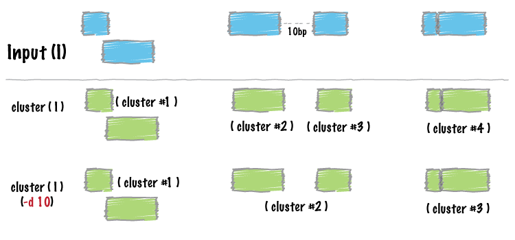

.. _cluster:

###############
*cluster*
###############

|

|

Similar to :doc:`../tools/merge`, ``cluster`` report each set of overlapping or 
"book-ended" features in an interval file.  In contrast to ``merge``, 
``cluster`` does not flatten the cluster of intervals into a new meta-interval;
instead, it assigns an unique cluster ID to each record in each cluster.  This
is useful for having fine control over how sets of overlapping intervals in 
a single interval file are combined.

.. note::

    ``bedtools cluster`` requires that you presort your data by chromosome and
    then by start position (e.g., ``sort -k1,1 -k2,2n in.bed > in.sorted.bed``
    for BED files).
    
.. seealso::

    :doc:`../tools/merge`
    

==========================================================================
Usage and option summary
==========================================================================
**Usage**:
::

  bedtools cluster [OPTIONS] -i <BED/GFF/VCF> 

**(or)**:
::

  clusterBed [OPTIONS] -i <BED/GFF/VCF>

  
===========================      ===============================================================================================================================================================================================================
Option                           Description
===========================      ===============================================================================================================================================================================================================
**-s**				             Force strandedness. That is, only cluster features that are the same strand. *By default, this is disabled*.
**-d**                           Maximum distance between features allowed for features to be clustered. *Default is 0. That is, overlapping and/or book-ended features are clustered*.
===========================      ===============================================================================================================================================================================================================

==========================================================================
Default behavior
==========================================================================
By default, ``bedtools cluster`` collects overlapping (by at least 1 bp) and/or
bookended intervals into distinct clusters.  In the example below, the 4th 
column is the cluster ID.
  
.. code-block:: bash

  $ cat A.bed
  chr1  100  200
  chr1  180  250
  chr1  250  500
  chr1  501  1000

  $ bedtools cluster -i A.bed
  chr1	100	200	1
  chr1	180	250	1
  chr1	250	500	1
  chr1	501	1000	2

==========================================================================
``-s`` Enforcing "strandedness" 
==========================================================================
The ``-s`` option will only cluster intervals that are overlapping/bookended
*and* are on the same strand.

.. code-block:: bash

  $ cat A.bed
  chr1  100  200   a1  1 +
  chr1  180  250   a2  2 +
  chr1  250  500   a3  3 - 
  chr1  501  1000  a4  4 +

  $ bedtools cluster -i A.bed -s
  chr1	100	200	a1	1	+	1
  chr1	180	250	a2	2	+	1
  chr1	501	1000	a4	4	+	2
  chr1	250	500	a3	3	-	3

==========================================================================
``-d`` Controlling how close two features must be in order to cluster 
==========================================================================
By default, only overlapping or book-ended features are combined into a new 
feature. However, one can force ``cluster`` to combine more distant features 
with the ``-d`` option. For example, were one to set ``-d`` to 1000, any 
features that overlap or are within 1000 base pairs of one another will be 
clustered.

.. code-block:: bash

  $ cat A.bed
  chr1  100  200
  chr1  501  1000
  
  $ bedtools cluster -i A.bed
  chr1  100  200    1
  chr1  501  1000   2

  $ bedtools cluster -i A.bed -d 1000
  chr1  100  200    1
  chr1  501  1000   1

