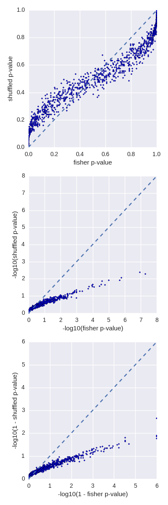

.. _fisher:

########
*fisher*
########

Perform fisher's exact test on the number of overlaps/unique intervals between
2 files.

|

Traditionally, in order to test whether 2 sets of intervals are related
spatially, we resort to shuffling the genome and checking the simulated
(shuffled) versus the observed. We can do the same analytically for many
scenarios using 
`Fisher's Exact Test`_ .

This implementation can calculate the number of overlaps and the number
of intervals unique to each file and it infers (or accepts) the number
that are not present in each file.

Given a pair of input files `-a` and `-b` in the usual BedTools parlance:

.. code-block:: bash

  $ cat a.bed
  chr1  10  20
  chr1  30  40
  chr1	51	52

  $ cat b.bed
  chr1  15   25
  chr1	51	52

And a genome of 500 bases:

.. code-block:: bash

    $ echo -e "chr1\t500" > t.genome

We may wish to know **if the amount of overlap between the 2 sets of intervals is
more than we would expect given their coverage and the size of the genome**. We
can do this with ``fisher`` as:

.. code-block:: bash

    $ bedtools fisher -a a.bed -b b.bed -g t.genome
    # Number of query intervals: 3
    # Number of db intervals: 2
    # Number of overlaps: 2
    # Number of possible intervals (estimated): 37
    # phyper(2 - 1, 3, 37 - 3, 2, lower.tail=F)
    # Contingency Table Of Counts
    #_________________________________________
    #           |  in -b       | not in -b    |
    #     in -a | 2            | 1            |
    # not in -a | 0            | 34           |
    #_________________________________________
    # p-values for fisher's exact test
    left    right   two-tail    ratio
    1   0.0045045   0.0045045   inf

Where we can see the constructed contingency table and the pvalues for left, right
and two-tail tests.
From here, we can say that given **500 bases** of genome, it is unlikely that we
would see **as many** overlaps as we do if the intervals from `a` and `b` were not
related.

.. note::

    the total number of **possible** intervals in the above example was
    estimated to be 37. This is based on a heuristic that uses the mean sizes of
    intervals in the `a` and `b` sets and the size of the genome. The reported
    p-value will depend greatly on this. Below, we show how well the reported
    value matches with simulations.

The above had a fairly low p-value (0.0045), but if our genome were only **60 bases**:

.. code-block:: bash

    $ echo -e "chr1\t60" > t.genome
    $ bedtools fisher -a a.bed -b b.bed -g t.genome
    # Number of query intervals: 3
    # Number of db intervals: 2
    # Number of overlaps: 2
    # Number of possible intervals (estimated): 4
    # phyper(2 - 1, 3, 4 - 3, 2, lower.tail=F)
    # Contingency Table Of Counts
    #_________________________________________
    #           |  in -b       | not in -b    |
    #     in -a | 2            | 1            |
    # not in -a | 0            | 1            |
    #_________________________________________
    # p-values for fisher's exact test
    left    right   two-tail    ratio
    1   0.5 1   inf

We can see that neither tail is significant. Intuitively, this makes sense; 
if we randomly place 3 intervals (from `-a`), and 2 (from `-b`) intervals from
within 60 bases, it doesn't seem unlikely that we'd see 2 overlaps.

Note also that since the genome size is much smaller, the number of possible
intervals is also decreased.

==========
Evaluation
==========

The p-value depends on knowing or inferring the total number of possible
intervals (to fill in the lower right corner of the contingency table). This
inference is not straightforward since we will most likely have variable sized
intervals within and between files. Below, we show the correspondence of
the p-value reported by `fisher` and one from simulated data.

    
    The comparison of the p-value from 'fisher' to one derived by simulation
    (see tests/fisher/ for details). The top plot shows the p-value distribution.
    Since we are most interested in extreme p-values, the middle plot shows
    -log10(p-value). The bottom plot is the same as the middle except looking at
    the other tail of the p-value distribution.
    
    Note that we do see inflation from the fisher test, but we do not see
    'false-negatives'--that is, bedtools fisher is less likely to miss 'true'
    candidates, but it will give many candidates for further exploration. As
    such we recommend validating low p-values from fisher using simulation.
    
    This evaluation used all known canonical genes on chromosome 1 and repeatedly
    (1000 times) randomly generated 3000 intervals between 20 and 5250 bases. It
    then calculated the p-value for each set using fisher and then using shuffled
    data.

.. note::

    The ``fisher`` tool requires that your data is pre-sorted by chromosome and
    then by start position (e.g., ``sort -k1,1 -k2,2n in.bed > in.sorted.bed``
    for BED files).

    This uses Heng Li's implementation of Fisher's exact test in kfunc.c.

.. seealso::

    :doc:`../tools/jaccard`
    :doc:`../tools/reldist`
    :doc:`../tools/intersect`
    

===============================
Usage and option summary
===============================
**Usage**:
::

  bedtools fisher [OPTIONS] -a <BED/GFF/VCF> -b <BED/GFF/VCF> -g <genome>

===========================    =========================================================================================================================================================
Option                         Description
===========================    =========================================================================================================================================================
**-a**                           BED/GFF/VCF file A. Each feature in A is compared to B in search of overlaps. Use "stdin" if passing A with a UNIX pipe.
**-b**                           BED/GFF/VCF file B. Use "stdin" if passing B with a UNIX pipe.
**-g**                           genome file listing chromosome size.
**-f**                           Minimum overlap required as a fraction of A. Default is 1E-9 (i.e. 1bp).
**-r**                           Require that the fraction of overlap be reciprocal for A and B. In other words, if -f is 0.90 and -r is used, this requires that B overlap at least 90% of A and that A also overlaps at least 90% of B.
**-s**                         Force "strandedness". That is, only report hits in B that overlap A on the same strand. By default, overlaps are reported without respect to strand.
**-S**                         Require different strandedness.  That is, only report hits in B that overlap A on the _opposite_ strand. By default, overlaps are reported without respect to strand.
**-split**                     Treat "split" BAM (i.e., having an "N" CIGAR operation) or BED12 entries as distinct BED intervals.
===========================    =========================================================================================================================================================

.. _Fisher's Exact Test: http://en.wikipedia.org/wiki/Fisher's_exact_test
