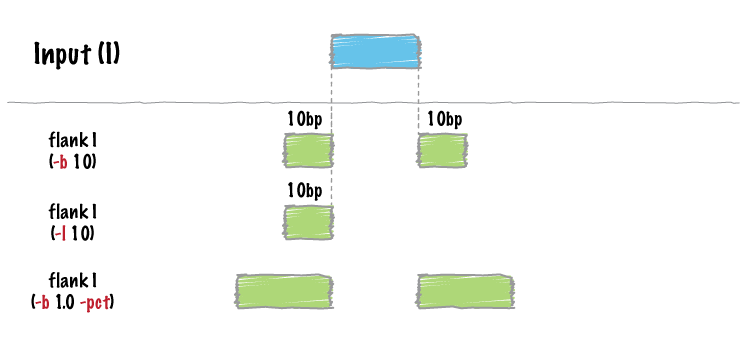

.. _flank:

###############
*flank*
###############

|

|

``bedtools flank`` will create two new flanking intervals for each interval in 
a BED/GFF/VCF file. Note that ``flank`` will restrict the created flanking
intervals to the size of the chromosome  (i.e. no start < 0 and no end > 
chromosome size).

.. note::

    In order to prevent creating intervals that violate chromosome boundaries,
    ``bedtools flank`` requires a *genome* file defining the length of each 
    chromosome or contig.

.. seealso::

    :doc:`../tools/slop`
    
==========================================================================
Usage and option summary
==========================================================================
**Usage**:
::

  bedtools flank [OPTIONS] -i <BED/GFF/VCF> -g <GENOME> [-b or (-l and -r)]

**(or):**
::

  flankBed [OPTIONS] -i <BED/GFF/VCF> -g <GENOME> [-b or (-l and -r)]
    
===========================      ===============================================================================================================================================================================================================
 Option                           Description
===========================      ===============================================================================================================================================================================================================
**-b**				             Increase the BED/GFF/VCF entry by the same number base pairs in each direction. *Integer*.							 
**-l**					         The number of base pairs to subtract from the start coordinate. *Integer*.
**-r**                           The number of base pairs to add to the end coordinate. *Integer*.
**-s**                           Define -l and -r based on strand. For example. if used, -l 500 for a negative-stranded feature, it will add 500 bp to the *end* coordinate.
**-pct**                         Define -l and -r as a fraction of the feature's length. E.g. if used on a 1000bp feature, -l 0.50, will add 500 bp "upstream".  Default = false.
===========================      ===============================================================================================================================================================================================================

==========================================================================
Default behavior
==========================================================================
By default, ``bedtools flank`` will either add a fixed number of bases in each 
direction (``-b``) or an asymmetric number of bases in each direction 
with ``-l`` and ``-r``.

.. code-block:: bash

  $ cat A.bed
  chr1 100 200
  chr1 500 600

  $ cat my.genome
  chr1 1000

  $ bedtools flank -i A.bed -g my.genome -b 5
  chr1	95	100
  chr1	200	205
  chr1	495	500
  chr1	600	605

  $ bedtools flank -i A.bed -g my.genome -l 2 -r 3
  chr1	98	100
  chr1	200	203
  chr1	498	500
  chr1	600	603
  

However, if the requested number of bases exceeds the boundaries of the 
chromosome, ``bedtools flank`` will "clip" the feature accordingly.

.. code-block:: bash

  $ cat A.bed
  chr1 100 200
  chr1 500 600

  $ cat my.genome
  chr1 1000

  $ bedtools flank -i A.bed -g my.genome -b 800
  chr1	0	100
  chr1	200	1000
  chr1	0	500
  chr1	600	1000

==========================================================================
``-pct`` Resizing features by a given fraction
==========================================================================
``bedtools flank`` will optionally create flanking intervals whose size is  
user-specified fraction of the original interval.

For example:

.. code-block:: bash

  $ cat A.bed
  chr1 100 200
  chr1 500 700
  
  ################################################################
  # note the flanking intervals from the second record in A.bed
  # are 20bp whereas the flanking intervals from the first record
  # are only 10bp
  ################################################################
  $ bedtools flank -i A.bed -g my.genome -b 0.1 -pct
  chr1	90	100
  chr1	200	210
  chr1	480	500
  chr1	700	720

