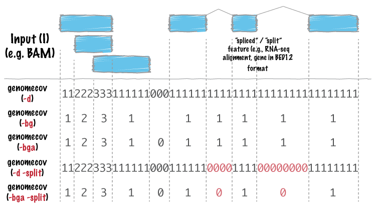
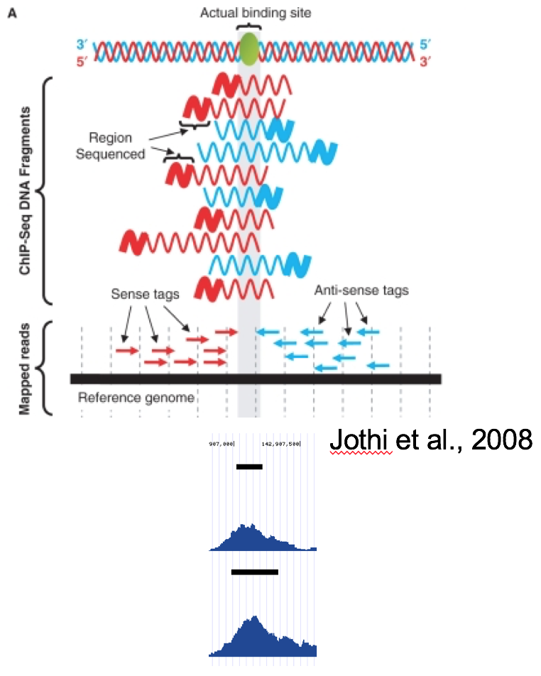

.. _genomecov:

###############
*genomecov*
###############

|

|

``bedtools genomecov`` computes histograms (default), per-base reports (``-d``) 
and BEDGRAPH (``-bg``) summaries of feature coverage (e.g., aligned sequences) 
for a given genome. 

.. note::

  1. If using BED/GFF/VCF, the input (``-i``) file must be grouped by 
  chromosome. A simple  ``sort -k 1,1 in.bed > in.sorted.bed`` will suffice.
  Also, if using BED/GFF/VCF, one must provide a genome file via the ``-g``
  argument.

  2. If the input is in BAM (-ibam) format, the BAM file must be sorted 
  by position.  Using ``samtools sort aln.bam aln.sorted`` will suffice.

===============================
Usage and option summary
===============================
**Usage**:
::

  bedtools genomecov [OPTIONS] [-i|-ibam] -g (iff. -i and not -ibam)

**(or)**:
::

  genomeCoverageBed [OPTIONS] [-i|-ibam] -g (iff. -i and not -ibam)

===========================      ===============================================================================================================================================================================================================
 Option                           Description
===========================      ===============================================================================================================================================================================================================
**-ibam**                        | BAM file as input for coverage. Each BAM alignment in A added to the total coverage for the genome. 
                                 | Use "stdin" or simply "-" if passing it with a UNIX pipe: For example:
                                 | ``samtools view -b <BAM> | genomeCoverageBed -ibam stdin``
**-g**                           Provide a genome file to define chromosome lengths. Required when not using -ibam option.
**-d**                           Report the depth at each genome position with 1-based coordinates.
**-dz**                          Report the depth at each genome position with 0-based coordinates.
                                 Unlike, `-d`, this reports only non-zero positions.
**-bg**                          Report depth in BedGraph format. For details, see: http://genome.ucsc.edu/goldenPath/help/bedgraph.html
**-bga**                         Report depth in BedGraph format, as above (i.e., -bg). However with this option, regions with zero coverage are also reported. This allows one to quickly extract all regions of a genome with 0 coverage by applying: "grep -w 0$" to the output.
**-split**                       Treat "split" BAM or BED12 entries as distinct BED intervals when computing coverage. For BAM files, this uses the CIGAR "N" and "D" operations to infer the blocks for computing coverage. For BED12 files, this uses the BlockCount, BlockStarts, and BlockEnds fields (i.e., columns 10,11,12).
**-strand**                      Calculate coverage of intervals from a specific strand. With BED files, requires at least 6 columns (strand is column 6).
**-5**                           Calculate coverage of 5' positions (instead of entire interval).
**-3**                           Calculate coverage of 3' positions (instead of entire interval).
**-max**                         Combine all positions with a depth >= max into a single bin in the histogram.
**-scale**                       | Scale the coverage by a constant factor.
                                 | Each coverage value is multiplied by this factor before being reported.
                                 | Useful for normalizing coverage by, e.g., reads per million (RPM).
                                 | ``Default is 1.0; i.e., unscaled.``
**-trackline**                   | Adds a UCSC/Genome-Browser track line definition in the first line of the output.
                                 | See `here <http://genome.ucsc.edu/goldenPath/help/bedgraph.html>`_ for more details about track line definition:
**-trackopts**                   Writes additional track line definition parameters in the first line.
**-pc**                          | Calculates coverage of intervals from left point of a pair reads to the right point.
                                 | Works for BAM files only
**-fs**                          | Forces to use fragment size instead of read length
                                 | Works for BAM files only

===========================      ===============================================================================================================================================================================================================

==========================================================================
Default behavior
==========================================================================
By default, ``bedtools genomecov`` will compute a histogram of coverage for 
the genome file provided. The default output format is as follows:

1. chromosome (or entire genome)
2. depth of coverage from features in input file
3. number of bases on chromosome (or genome) with depth equal to column 2.
4. size of chromosome (or entire genome) in base pairs
5. fraction of bases on chromosome (or entire genome) with depth equal to column 2.

For example:

.. code-block:: bash

  $ cat A.bed
  chr1  10  20
  chr1  20  30
  chr2  0   500

  $ cat my.genome
  chr1  1000
  chr2  500

  $ bedtools genomecov -i A.bed -g my.genome
  chr1   0  980  1000  0.98
  chr1   1  20   1000  0.02
  chr2   1  500  500   1
  genome 0  980  1500  0.653333
  genome 1  520  1500  0.346667

 
==========================================================================
``-max`` Controlling the histogram's maximum depth 
==========================================================================
Using the ``-max`` option, ``bedtools genomecov`` will "lump" all positions in
the genome having feature coverage greater than or equal to ``-max`` into 
the ``-max`` histogram bin. For example, if one sets ``-max``
equal to 50, the max depth reported in the output will be 50 and all positions 
with a depth >= 50 will be represented in bin 50.

==========================================================================
``-d`` Reporting "per-base" genome coverage 
==========================================================================
Using the ``-d`` option, ``bedtools genomecov`` will compute the depth of 
feature coverage for each base on each chromosome in genome file provided.

The "per-base" output format is as follows:

1. chromosome
2. chromosome position
3. depth (number) of features overlapping this chromosome position.

For example:

.. code-block:: bash

  $ cat A.bed
  chr1  10  20
  chr1  20  30
  chr2  0   500

  $ cat my.genome
  chr1  1000
  chr2  500

  $ bedtools genomecov -i A.bed -g my.genome -d | \
        head -15 | \
        tail -n 10
  chr1  6  0
  chr1  7  0
  chr1  8  0
  chr1  9  0
  chr1  10 0
  chr1  11 1
  chr1  12 1
  chr1  13 1
  chr1  14 1
  chr1  15 1

==========================================================================
``-bg`` Reporting genome coverage in BEDGRAPH format.
==========================================================================
Whereas the ``-d`` option reports an output line describing the observed 
coverage at each and every position in the genome, the ``-bg`` option instead
produces genome-wide coverage output in 
`BEDGRAPH <http://genome.ucsc.edu/goldenPath/help/bedgraph.html>`_ format. 
This is a much more concise representation since consecutive positions with the
same coverage are reported as a single output line describing the start and end
coordinate of the interval having the coverage level, followed by the coverage 
level itself.

For example, below is a snippet of BEDGRAPH output of the coverage from a 1000
Genome Project BAM file:

.. code-block:: bash
  
  $ bedtools genomecov -ibam NA18152.bam -bg | head
  chr1	554304	554309	5
  chr1	554309	554313	6
  chr1	554313	554314	1
  chr1	554315	554316	6
  chr1	554316	554317	5
  chr1	554317	554318	1
  chr1	554318	554319	2
  chr1	554319	554321	6
  chr1	554321	554323	1
  chr1	554323	554334	7

Using this format, one can quickly identify regions of the genome with
sufficient coverage (in this case, 10 or more reads) by piping the 
output to an ``awk`` filter.

.. code-block:: bash

  $ bedtools genomecov -ibam NA18152.bam -bg | \
      awk '$4 > 9' | \
      head
  chr1	554377	554381	11
  chr1	554381	554385	12
  chr1	554385	554392	16
  chr1	554392	554408	17
  chr1	554408	554410	19
  chr1	554410	554422	20
  chr1	554422	554423	19
  chr1	554423	554430	22
  chr1	554430	554440	24
  chr1	554440	554443	25

==========================================================================
``-bga`` Reporting genome coverage for *all* positions in BEDGRAPH format.
==========================================================================
The ``-bg`` option reports coverage in BEDGRAPH format only for those regions
of the genome that actually have coverage.  But what about the uncovered portion
of the genome?  By using the ``-bga`` option, one receives a complete report
including the regions with zero coverage.

For example, compare the output from ``-bg``:

.. code-block:: bash
  
  $ bedtools genomecov -ibam NA18152.bam -bg | head
  chr1	554304	554309	5
  chr1	554309	554313	6
  chr1	554313	554314	1
  chr1	554315	554316	6
  chr1	554316	554317	5
  chr1	554317	554318	1
  chr1	554318	554319	2
  chr1	554319	554321	6
  chr1	554321	554323	1
  chr1	554323	554334	7
  
to the output from ``-bga``:

.. code-block:: bash

  # Note the first record reports that the first 554304 
  # base pairs of chr1 had zero coverage
  $ bedtools genomecov -ibam NA18152.bam -bga | head
  chr1	0	554304	0
  chr1	554304	554309	5
  chr1	554309	554313	6
  chr1	554313	554314	1
  chr1	554314	554315	0
  chr1	554315	554316	6
  chr1	554316	554317	5
  chr1	554317	554318	1
  chr1	554318	554319	2
  chr1	554319	554321	6

==========================================================================
``-strand`` Reporting genome coverage for a specific strand.
==========================================================================
Whereas the default is to count coverage regardless of strand, the ``-strand`` 
option allows one to report the coverage observed for a specific strand. 

Compare:

.. code-block:: bash
  
  $ bedtools genomecov -ibam NA18152.bam -bg | head
  chr1	554304	554309	5
  chr1	554309	554313	6
  chr1	554313	554314	1
  chr1	554315	554316	6
  chr1	554316	554317	5
  chr1	554317	554318	1
  chr1	554318	554319	2
  chr1	554319	554321	6
  chr1	554321	554323	1
  chr1	554323	554334	7
  
to

.. code-block:: bash
  
  $ bedtools genomecov -ibam NA18152.bam -bg -strand + | head
  chr1	554385	554392	4
  chr1	554392	554408	5
  chr1	554408	554430	6
  chr1	554430	554451	7
  chr1	554451	554455	8
  chr1	554455	554490	9
  chr1	554490	554495	10
  chr1	554495	554496	9
  chr1	554496	554574	10
  chr1	554574	554579	11
  

==========================================================================
``-scale`` Scaling coverage by a constant factor.
==========================================================================
The ``-scale`` option allows one to scale the coverage observed in an interval
file by a constant factor. Each coverage value is multiplied by this factor 
before being reported. This can be useful for normalizing coverage by, 
e.g., metrics such as reads per million (RPM). 

Compare:

.. code-block:: bash
  
  $ bedtools genomecov -ibam NA18152.bam -bg | head
  chr1	554304	554309	5
  chr1	554309	554313	6
  chr1	554313	554314	1
  chr1	554315	554316	6
  chr1	554316	554317	5
  chr1	554317	554318	1
  chr1	554318	554319	2
  chr1	554319	554321	6
  chr1	554321	554323	1
  chr1	554323	554334	7
  
to

.. code-block:: bash
  
  $ bedtools genomecov -ibam NA18152.bam -bg -scale 10.0 | head
  chr1	554304	554309	50
  chr1	554309	554313	60
  chr1	554313	554314	10
  chr1	554315	554316	60
  chr1	554316	554317	50
  chr1	554317	554318	10
  chr1	554318	554319	20
  chr1	554319	554321	60
  chr1	554321	554323	10
  chr1	554323	554334	70
  

==============================================================================
``-split`` Reporting coverage with spliced alignments or blocked BED features 
==============================================================================
``bedtools genomecov`` will, by default, screen for overlaps against the
entire span of a spliced/split BAM alignment or blocked BED12 feature. When 
dealing with RNA-seq reads, for example, one typically wants to only screen 
for overlaps for the portions of the reads that come from exons (and ignore the 
interstitial intron sequence). The ``-split`` command allows for such
overlaps to be performed.

==============================================================================
Coverage by fragment
==============================================================================

|

|

In ChiP-Seq the binding site is usually not at the coordinate where reads map,
but in the middle of the fragment. For this reason we often try to estimate average fragment size
for single-read experiment and extend the reads in the 5’-3’ direction up to the estimated fragment length.
The coverage "by estimated fragments" or by actual pair-end fragments graph is expected to peak at the actual binding site.

``-fs`` Forces to use provided fragment size.

``-pc`` Calculates coverage for paired-end reads, coverage is calculated as the number of fragments covering each base pair
