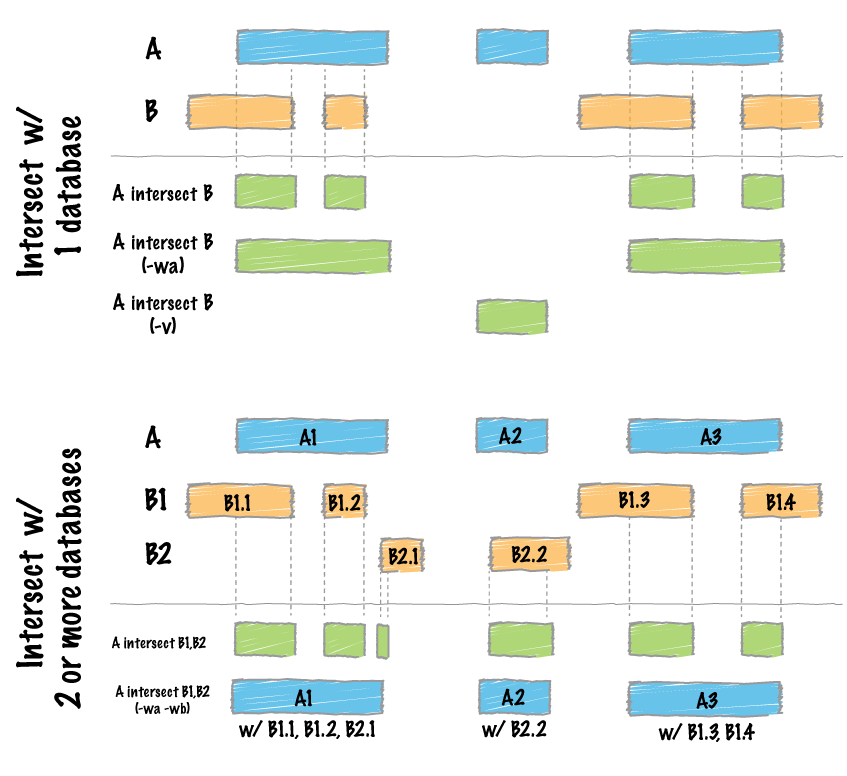

.. _intersect:

#########################################
*intersect* 
#########################################

|

|

By far, the most common question asked of two sets of genomic features 
is whether or not any of the features in the two sets "overlap" 
with one another. This is known as feature intersection. 
``bedtools intersect`` allows one to screen for overlaps between 
two sets of genomic features. Moreover, it allows one to have fine control 
as to how the intersections are reported. ``bedtools intersect`` works 
with both BED/GFF/VCF and BAM files as input.

.. note::

    If you are trying to intersect very large files and are having trouble
    with excessive memory usage, please presort your data by chromosome and
    then by start position (e.g., ``sort -k1,1 -k2,2n in.bed > in.sorted.bed``
    for BED files) and then use the ``-sorted`` option.  This invokes a 
    memory-efficient algorithm designed for large files. This algorithm has
    been *substantially* improved in recent (>=2.18.0) releases. 

.. important::

    As of version 2.21.0, the `intersect` tool can accept multiple files for
    the `-b` option. This allows one to identify overlaps between a single
    query (`-a`) file and multiple database files (`-b`) at once!

.. seealso::

    :doc:`../tools/subtract`
    :doc:`../tools/map`
    :doc:`../tools/window`
    
===============================
Usage and option summary
===============================
**Usage**:
::

  bedtools intersect [OPTIONS] -a <FILE> \
                               -b <FILE1, FILE2, ..., FILEN>

**(or)**:
::

  intersectBed [OPTIONS] -a <FILE> \
                         -b <FILE1, FILE2, ..., FILEN>

===========================    =========================================================================================================================================================
Option                         Description
===========================    =========================================================================================================================================================
**-a**		                     BAM/BED/GFF/VCF file "A". Each feature in A is compared to B in search of overlaps. Use "stdin" if passing A with a UNIX pipe.
**-b**		                     One or more BAM/BED/GFF/VCF file(s) "B". Use "stdin" if passing B with a UNIX pipe.
                               **NEW!!!**: -b may be followed with multiple databases and/or wildcard (*) character(s).
**-abam**	                     BAM file A. Each BAM alignment in A is compared to B in search of overlaps. Use "stdin" if passing A with a UNIX pipe: For example: samtools view -b <BAM> | bedtools intersect -abam stdin -b genes.bed.  **Note**: no longer necessary after version 2.19.0                                                 
**-ubam**	                     Write uncompressed BAM output. The default is write compressed BAM output.
**-bed**	                     When using BAM input (-abam), write output as BED. The default is to write output in BAM when using -abam. For example:   ``bedtools intersect -abam reads.bam -b genes.bed -bed``                              
**-wa**		                     Write the original entry in A for each overlap.
**-wb** 	                     Write the original entry in B for each overlap. Useful for knowing what A overlaps. Restricted by -f and -r.
**-loj**                         Perform a "left outer join". That is, for each feature in A report each overlap with B.  If no overlaps are found, report a NULL feature for B.
**-wo** 	                     Write the original A and B entries plus the number of base pairs of overlap between the two features. Only A features with overlap are reported. Restricted by -f and -r.
**-wao** 	   	                 Write the original A and B entries plus the number of base pairs of overlap between the two features. However, A features w/o overlap are also reported with a NULL B feature and overlap = 0. Restricted by -f and -r.
**-u**		                     Write original A entry once if any overlaps found in B. In other words, just report the fact at least one overlap was found in B. Restricted by -f and -r.
**-c** 		                     For each entry in A, report the number of hits in B while restricting to -f. Reports 0 for A entries that have no overlap with B. Restricted -f, -F, -r, and -s.
**-C**                         For each entry in A, separately report the number of overlaps with each B file on a distinct line. Reports 0 for A entries that have no overlap with B. Overlaps restricted by -f, -F, -r, and -s.
**-v**	 	                     Only report those entries in A that have no overlap in B. Restricted by -f and -r.
**-f**		                     Minimum overlap required as a fraction of A. Default is 1E-9 (i.e. 1bp).
**-F**                         Minimum overlap required as a fraction of B. Default is 1E-9 (i.e., 1bp).
**-r**		                     Require that the fraction of overlap be reciprocal for A and B. In other words, if -f is 0.90 and -r is used, this requires that B overlap at least 90% of A and that A also overlaps at least 90% of B.
**-e**                         Require that the minimum fraction be satisfied for A _OR_ B. In other words, if -e is used with -f 0.90 and -F 0.10 this requires that either 90% of A is covered OR 10% of  B is covered. Without -e, both fractions would have to be satisfied.
**-s**		                     Force "strandedness". That is, only report hits in B that overlap A on the same strand. By default, overlaps are reported without respect to strand.
**-S**	                       Require different strandedness.  That is, only report hits in B that overlap A on the _opposite_ strand. By default, overlaps are reported without respect to strand.
**-split**	                   Treat "split" BAM (i.e., having an "N" CIGAR operation) or BED12 entries as distinct BED intervals.
**-sorted**	                   For very large B files, invoke a "sweeping" algorithm that requires position-sorted (e.g., ``sort -k1,1 -k2,2n`` for BED files) input. When using -sorted, memory usage remains low even for very large files.
**-g**                         Specify a genome file the defines the expected chromosome order in the input files for use with the ``-sorted`` option.
**-header**	                   Print the header from the A file prior to results.
**-names**                     When using *multiple databases* (`-b`), provide an alias for each that will appear instead of a fileId when also printing the DB record.
**-filenames**                 When using *multiple databases* (`-b`), show each complete filename instead of a fileId when also printing the DB record.
**-sortout**                   When using *multiple databases* (`-b`), sort the output DB hits for each record.
**-nobuf**                     Disable buffered output. Using this option will cause each line of output to be printed as it is generated, rather than saved in a buffer. This will make printing large output files noticeably slower, but can be useful in conjunction with other software tools and scripts that need to process one line of bedtools output at a time.
**-iobuf**                     Follow with desired integer size of read buffer. Optional suffixes `K/M/G` supported. **Note**: currently has no effect with compressed files.
===========================    =========================================================================================================================================================

===============================
Default behavior
===============================
By default, if an overlap is found, ``bedtools intersect`` reports the shared interval between the two
overlapping features.

.. code-block:: bash

  $ cat A.bed
  chr1  10  20
  chr1  30  40

  $ cat B.bed
  chr1  15   20

  $ bedtools intersect -a A.bed -b B.bed
  chr1  15   20

==========================================================================
Intersecting against MULTIPLE -b files.
==========================================================================
As of version 2.21.0, the `intersect` tool can detect overlaps between
a single `-a` file and multiple `-b` files (instead of just one previously).
One simply provides multiple `-b` files on the command line.

For example, consider the following query (`-a`) file and three distinct (`-b`) files:

.. code-block:: bash
  
  $ cat query.bed
  chr1  1   20
  chr1  40  45
  chr1  70  90
  chr1  105 120
  chr2  1   20
  chr2  40  45
  chr2  70  90
  chr2  105 120
  chr3  1   20
  chr3  40  45
  chr3  70  90
  chr3  105 120
  chr3  150 200
  chr4  10  20

  $ cat d1.bed
  chr1  5   25
  chr1  65  75
  chr1  95  100
  chr2  5   25
  chr2  65  75
  chr2  95  100
  chr3  5   25
  chr3  65  75
  chr3  95  100
  
  $ cat d2.bed
  chr1  40  50
  chr1  110 125
  chr2  40  50
  chr2  110 125
  chr3  40  50
  chr3  110 125
  
  $ cat d3.bed
  chr1  85  115
  chr2  85  115
  chr3  85  115

We can now compare query.bed to all three database files at once.:

.. code-block:: bash

  $ bedtools intersect -a query.bed \
      -b d1.bed d2.bed d3.bed
  chr1  5   20
  chr1  40  45
  chr1  70  75
  chr1  85  90
  chr1  110 120
  chr1  105 115
  chr2  5   20
  chr2  40  45
  chr2  70  75
  chr2  85  90
  chr2  110 120
  chr2  105 115
  chr3  5   20
  chr3  40  45
  chr3  70  75
  chr3  85  90
  chr3  110 120
  chr3  105 115

Clearly this is not completely informative because we cannot tell from which file each intersection came. However, if we use `-wa` and `-wb`, this becomes abundantly clear. When these options are used, the first column after the complete `-a` record lists the file number from which the overlap came. The number corresponds to the order in which the files were given on the command line. 

.. code-block:: bash

  $ bedtools intersect -wa -wb \
      -a query.bed \
      -b d1.bed d2.bed d3.bed \
      -sorted
  chr1  1   20  1 chr1  5   25
  chr1  40  45  2 chr1  40  50
  chr1  70  90  1 chr1  65  75
  chr1  70  90  3 chr1  85  115
  chr1  105 120 2 chr1  110 125
  chr1  105 120 3 chr1  85  115
  chr2  1   20  1 chr2  5   25
  chr2  40  45  2 chr2  40  50
  chr2  70  90  1 chr2  65  75
  chr2  70  90  3 chr2  85  115
  chr2  105 120 2 chr2  110 125
  chr2  105 120 3 chr2  85  115
  chr3  1   20  1 chr3  5   25
  chr3  40  45  2 chr3  40  50
  chr3  70  90  1 chr3  65  75
  chr3  70  90  3 chr3  85  115
  chr3  105 120 2 chr3  110 125
  chr3  105 120 3 chr3  85  115

In many cases, it may be more useful to report an informative "label" for each file instead of a file number.  One can do this with the `-names` option.

.. code-block:: bash

  $ bedtools intersect -wa -wb \
      -a query.bed \
      -b d1.bed d2.bed d3.bed \
      -names d1 d2 d3 \
      -sorted
  chr1  1   20  d1  chr1  5   25
  chr1  40  45  d2  chr1  40  50
  chr1  70  90  d1  chr1  65  75
  chr1  70  90  d3  chr1  85  115
  chr1  105 120 d2  chr1  110 125
  chr1  105 120 d3  chr1  85  115
  chr2  1   20  d1  chr2  5   25
  chr2  40  45  d2  chr2  40  50
  chr2  70  90  d1  chr2  65  75
  chr2  70  90  d3  chr2  85  115
  chr2  105 120 d2  chr2  110 125
  chr2  105 120 d3  chr2  85  115
  chr3  1   20  d1  chr3  5   25
  chr3  40  45  d2  chr3  40  50
  chr3  70  90  d1  chr3  65  75
  chr3  70  90  d3  chr3  85  115
  chr3  105 120 d2  chr3  110 125
  chr3  105 120 d3  chr3  85  115

Or perhaps it may be more useful to report the file name.  One can do this with the `-filenames` option.

.. code-block:: bash

  $ bedtools intersect -wa -wb \
      -a query.bed \
      -b d1.bed d2.bed d3.bed \
      -sorted \
      -filenames 
  chr1  1   20  d1.bed  chr1  5   25
  chr1  40  45  d2.bed  chr1  40  50
  chr1  70  90  d1.bed  chr1  65  75
  chr1  70  90  d3.bed  chr1  85  115
  chr1  105 120 d2.bed  chr1  110 125
  chr1  105 120 d3.bed  chr1  85  115
  chr2  1   20  d1.bed  chr2  5   25
  chr2  40  45  d2.bed  chr2  40  50
  chr2  70  90  d1.bed  chr2  65  75
  chr2  70  90  d3.bed  chr2  85  115
  chr2  105 120 d2.bed  chr2  110 125
  chr2  105 120 d3.bed  chr2  85  115
  chr3  1   20  d1.bed  chr3  5   25
  chr3  40  45  d2.bed  chr3  40  50
  chr3  70  90  d1.bed  chr3  65  75
  chr3  70  90  d3.bed  chr3  85  115
  chr3  105 120 d2.bed  chr3  110 125
  chr3  105 120 d3.bed  chr3  85  115

Other options to `intersect` can be used as well.  For example, let's use `-v` to report those intervals in query.bed that do not overlap any of the intervals in the three database files:

.. code-block:: bash

  $ bedtools intersect -wa -wb \
      -a query.bed \
      -b d1.bed d2.bed d3.bed \
      -sorted \
      -v 
  chr3  150 200
  chr4  10  20

Or, let's report only those intersections where 100% of the query record is overlapped by a database record:

.. code-block:: bash

  $ bedtools intersect -wa -wb \
      -a query.bed \
      -b d1.bed d2.bed d3.bed \
      -sorted \
      -names d1 d2 d3
      -f 1.0
  chr1  40  45  d2  chr1  40  50
  chr2  40  45  d2  chr2  40  50
  chr3  40  45  d2  chr3  40  50

=============================================
``-wa`` Reporting the original A feature 
=============================================
Instead, one can force ``bedtools intersect`` to report the *original* **"A"** feature when an overlap is found. As
shown below, the entire "A" feature is reported, not just the portion that overlaps with the "B" feature.

For example:

.. code-block:: bash

  $ cat A.bed
  chr1  10  20
  chr1  30   40

  $ cat B.bed
  chr1  15  20

  $ bedtools intersect -a A.bed -b B.bed -wa
  chr1  10   20

=============================================
``-wb`` Reporting the original B feature 
=============================================
Similarly, one can force ``bedtools intersect`` to report the *original* **"B"** feature when an overlap is found. If
just -wb is used, the overlapping portion of A will be reported followed by the *original* **"B"**. If both -wa
and -wb are used, the *originals* of both **"A"** and **"B"** will be reported.

For example (-wb alone):

.. code-block:: bash

  $ cat A.bed
  chr1  10  20
  chr1  30  40

  $ cat B.bed
  chr1  15   20

  $ bedtools intersect -a A.bed -b B.bed -wb
  chr1  15  20  chr1 15  20
  

Now -wa and -wb:

.. code-block:: bash

  $ cat A.bed
  chr1  10  20
  chr1  30  40

  $ cat B.bed
  chr1  15   20

  $ bedtools intersect -a A.bed -b B.bed -wa -wb
  chr1  10  20  chr1 15  20

========================================================================
``-loj`` Left outer join. Report features in A with and without overlaps
========================================================================
By default, ``bedtools intersect`` will only report features in A that
have an overlap in B.  The ``-loj`` option will report every A feature
no matter what.  When there is an overlap (or more than 1), it will report
A with its overlaps. Yet when there are no overlaps, an A feature will be
reported with a NULL B feature to indicate that there were no overlaps

For example (*without* ``-loj``):

.. code-block:: bash

  $ cat A.bed
  chr1  10  20
  chr1  30  40

  $ cat B.bed
  chr1  15   20
  
  $ bedtools intersect -a A.bed -b B.bed
  chr1  10  20  chr1    15  20
  
Now *with* ``-loj``:

.. code-block:: bash

    $ cat A.bed
    chr1  10  20
    chr1  30  40

    $ cat B.bed
    chr1  15   20

    $ bedtools intersect -a A.bed -b B.bed -loj
    chr1  10  20  chr1 15  20
    chr1  30  40  . -1  -1

=======================================================================
``-wo`` Write the *amount* of overlap between intersecting features 
=======================================================================
The ``-wo`` option reports a column after each combination of intersecting
"A" and "B" features indicating the *amount* of overlap in bases pairs that
is observed between the two features. 

.. note::

    When an interval in A does not intersect an interval in B, it will not be
    reported.  If you would like to report such intervals with an overlap equal
    to 0, see the ``-wao`` option.

.. code-block:: bash

    $ cat A.bed
    chr1    10    20
    chr1    30    40

    $ cat B.bed
    chr1    15  20
    chr1    18  25

    $ bedtools intersect -a A.bed -b B.bed -wo
    chr1    10    20    chr1    15  20  5
    chr1    10    20    chr1    18  25  2

=======================================================================
``-wao`` Write *amounts* of overlap for all features. 
=======================================================================
The ``-wao`` option extends upon the ``-wo`` option in that, unlike ``-wo``,
it reports an overlap of 0 for features in A that do not have an intersection
in B. 

.. code-block:: bash

    $ cat A.bed
    chr1    10    20
    chr1    30    40

    $ cat B.bed
    chr1    15  20
    chr1    18  25

    $ bedtools intersect -a A.bed -b B.bed -wao
    chr1    10    20    chr1    15  20  5
    chr1    10    20    chr1    18  25  2
    chr1    30    40    .       -1  -1  0

==========================================================================
``-u`` (unique) Reporting the mere presence of *any* overlapping features 
==========================================================================
Often you'd like to simply know a feature in "A" overlaps one or more
features in B without reporting each and every intersection.  The ``-u``
option will do exactly this: if an one or more overlaps exists, the 
A feature is reported.  Otherwise, nothing is reported.

For example, without ``-u``:

.. code-block:: bash

    $ cat A.bed
    chr1  10  20

    $ cat B.bed
    chr1  15  20
    chr1  17  22

    $ bedtools intersect -a A.bed -b B.bed
    chr1  15   20
    chr1  17   20
    
Now with ``-u``:

.. code-block:: bash

    $ cat A.bed
    chr1  10  20

    $ cat B.bed
    chr1  15  20
    chr1  17  22

    $ bedtools intersect -a A.bed -b B.bed -u
    chr1  10   20

=======================================================================
``-c`` Reporting the number of overlapping features 
=======================================================================
The -c option reports a column after each "A" feature indicating the *number* (0 or more) of overlapping
features found in "B". Therefore, *each feature in A is reported once*.

.. code-block:: bash

    $ cat A.bed
    chr1    10    20
    chr1    30    40

    $ cat B.bed
    chr1    15  20
    chr1    18  25

    $ bedtools intersect -a A.bed -b B.bed -c
    chr1    10    20    2
    chr1    30    40    0

The `-c` option can also work with multiple -B files. In this case, the reported count will reflect the total number of intersections observed across _all_ `-B` files. It will not report a separate count for each database file. This can be achieved with the `-C` option.

.. code-block:: bash

    $ cat A.bed
    chr1    10    20
    chr1    30    40

    $ cat B.bed
    chr1    15  20
    chr1    18  25

    $ cat C.bed
    chr1    16  21
    chr1    19  26

    $ bedtools intersect -a A.bed -b B.bed -c
    chr1    10    20    4
    chr1    30    40    0

==========================================================================
``-C`` Reporting the number of overlapping features for each database file
==========================================================================
Unlike the the `-c` option, in the case of multiple `-B` files, the `-C` option will  report a separate count for each database file. 

.. code-block:: bash

    $ cat A.bed
    chr1    10    20
    chr1    30    40

    $ cat B.bed
    chr1    15  20
    chr1    18  25

    $ cat C.bed
    chr1    16  21
    chr1    19  26

    $ bedtools intersect -a A.bed -b B.bed -C
    chr1    10    20    1 2
    chr1    10    20    2 2
    chr1    30    40    1 0
    chr1    30    40    1 0

If you would like to see more useful information than the file _number_ from which the counts came, one can use the `-filenames` or `-names` options.

.. code-block:: bash

    $ bedtools intersect -a A.bed -b B.bed -C -filenames
    chr1    10    20    A.bed 2
    chr1    10    20    B.bed 2
    chr1    30    40    A.bed 0
    chr1    30    40    B.bed 0

    $ bedtools intersect -a A.bed -b B.bed -C -names a b
    chr1    10    20    a 2
    chr1    10    20    b 2
    chr1    30    40    a 0
    chr1    30    40    b 0

=======================================================================
``-v`` Reporting the absence of any overlapping features 
=======================================================================
There will likely be cases where you'd like to know which "A" features 
do not overlap with any of the "B" features. Perhaps you'd like to know 
which SNPs don't overlap with any gene annotations. The ``-v`` 
(an homage to "grep -v") option will only report those "A" features 
that have no overlaps in "B".

.. code-block:: bash

    $ cat A.bed
    chr1  10  20
    chr1  30  40

    $ cat B.bed
    chr1  15  20

    $ bedtools intersect -a A.bed -b B.bed -v
    chr1  30   40

=======================================================================
``-f`` Requiring a minimal overlap fraction 
=======================================================================
By default, ``bedtools intersect`` will report an overlap between A and B so long as there is at least one base
pair is overlapping. Yet sometimes you may want to restrict reported overlaps between A and B to cases
where the feature in B overlaps at least X% (e.g. 50%) of the A feature. The -f option does exactly
this.

For example (note that the second B entry is not reported):

.. code-block:: bash

  $ cat A.bed
  chr1 100 200
  
  $ cat B.bed
  chr1 130 201
  chr1 180 220
  
  $ bedtools intersect -a A.bed -b B.bed -f 0.50 -wa -wb
  chr1 100 200 chr1 130 201

==========================================================================
``-r, and -f`` Requiring reciprocal minimal overlap fraction 
==========================================================================
Similarly, you may want to require that a minimal fraction of both the A and the B features is
overlapped. For example, if feature A is 1kb and feature B is 1Mb, you might not want to report the
overlap as feature A can overlap at most 1% of feature B. If one set -f to say, 0.02, and one also
enable the -r (reciprocal overlap fraction required), this overlap would not be reported.

For example (note that the second B entry is not reported):

.. code-block:: bash

  $ cat A.bed
  chr1 100 200
  
  $ cat B.bed
  chr1 130 201
  chr1 130 200000
  
  $ bedtools intersect -a A.bed -b B.bed -f 0.50 -r -wa -wb
  chr1 100 200 chr1 130 201

==========================================================================
``-s`` Enforcing *same* strandedness 
==========================================================================
By default, ``bedtools intersect`` will report overlaps between features 
even if the features are on opposite strands. However, if strand information 
is present in both BED files and the "-s" option is used, overlaps will only 
be reported when features are on the same strand.

For example (note that the first B entry is not reported):

.. code-block:: bash

  $ cat A.bed
  chr1 100 200 a1 100 +
  
  $ cat B.bed
  chr1 130 201 b1 100 -
  chr1 132 203 b2 100 +
  
  $ bedtools intersect -a A.bed -b B.bed -wa -wb -s
  chr1 100 200 a1 100 + chr1 132 203 b2 100 +
  

==========================================================================
``-S`` Enforcing *opposite* "strandedness" 
==========================================================================
The ``-s`` option enforces that overlaps be on the *same* strand.  In some
cases, you may want to enforce that overlaps be found on *opposite* strands.
In this, case use the ``-S`` option.

For example:

.. code-block:: bash

  $ cat A.bed
  chr1 100 200 a1 100 +
  
  $ cat B.bed
  chr1 130 201 b1 100 -
  chr1 132 203 b2 100 +
  
  $ bedtools intersect -a A.bed -b B.bed -wa -wb -S
  chr1 100 200 a1 100 + chr1 130 201 b1 100 -
  
  
==========================================================================
``-abam`` Default behavior when using BAM input (deprecated since 2.18.0)
==========================================================================
When comparing alignments in BAM format (**-abam**) to features in BED format (**-b**), ``bedtools intersect``
will, **by default**, write the output in BAM format. That is, each alignment in the BAM file that meets
the user's criteria will be written (to standard output) in BAM format. This serves as a mechanism to
create subsets of BAM alignments are of biological interest, etc. Note that only the mate in the BAM
alignment is compared to the BED file. Thus, if only one end of a paired-end sequence overlaps with a
feature in B, then that end will be written to the BAM output. By contrast, the other mate for the
pair will not be written. One should use **pairToBed(Section 5.2)** if one wants each BAM alignment
for a pair to be written to BAM output.

.. code-block:: bash

  $ bedtools intersect -abam reads.unsorted.bam -b simreps.bed | \
         samtools view - | \
             head -3
  
  BERTHA_0001:3:1:15:1362#0 99 chr4 9236904 0 50M = 9242033 5 1 7 9
  AGACGTTAACTTTACACACCTCTGCCAAGGTCCTCATCCTTGTATTGAAG W c T U ] b \ g c e g X g f c b f c c b d d g g V Y P W W _
  \c`dcdabdfW^a^gggfgd XT:A:R NM:i:0 SM:i:0 AM:i:0 X0:i:19 X1:i:2 XM:i:0 XO:i:0 XG:i:0 MD:Z:50
  BERTHA _0001:3:1:16:994#0 83 chr6 114221672 37 25S6M1I11M7S =
  114216196 -5493 G A A A G G C C A G A G T A T A G A A T A A A C A C A A C A A T G T C C A A G G T A C A C T G T T A
  gffeaaddddggggggedgcgeggdegggggffcgggggggegdfggfgf XT:A:M NM:i:3 SM:i:37 AM:i:37 XM:i:2 X O : i :
  1 XG:i:1 MD:Z:6A6T3
  BERTHA _0001:3:1:16:594#0 147 chr8 43835330 0 50M =
  43830893 -4487 CTTTGGGAGGGCTTTGTAGCCTATCTGGAAAAAGGAAATATCTTCCCATG U
  \e^bgeTdg_Kgcg`ggeggg_gggggggggddgdggVg\gWdfgfgff XT:A:R NM:i:2 SM:i:0 AM:i:0 X0:i:10 X1:i:7 X M : i :
  2 XO:i:0 XG:i:0 MD:Z:1A2T45

.. note::

  As of version 2.18.0, it is no longer necessary to specify a BAM input file via ``-abam``. 
  Bedtools now autodetects this when ``-a`` is used.

==========================================================================
``-ubam`` Default behavior when using BAM input 
==========================================================================
The ``-ubam`` option writes *uncompressed* BAM output to stdout.  This is
useful for increasing the speed of pipelines that accept the output of
``bedtools`` intersect as input, since the receiving tool does not need to
uncompress the data.

==========================================================================
``-bed`` Output BED format when using BAM input 
==========================================================================
When comparing alignments in BAM format (**-abam**) to features in BED format (**-b**), ``bedtools intersect``
will **optionally** write the output in BED format. That is, each alignment in the BAM file is converted
to a 6 column BED feature and if overlaps are found (or not) based on the user's criteria, the BAM
alignment will be reported in BED format. The BED "name" field is comprised of the RNAME field in
the BAM alignment. If mate information is available, the mate (e.g., "/1" or "/2") field will be
appended to the name. The "score" field is the mapping quality score from the BAM alignment.

.. code-block:: bash

  $ bedtools intersect -abam reads.unsorted.bam -b simreps.bed -bed | head -20
  
  chr4  9236903   9236953   BERTHA_0001:3:1:15:1362#0/1  0   +
  chr6  114221671 114221721 BERTHA_0001:3:1:16:994#0/1   37  -
  chr8  43835329  43835379  BERTHA_0001:3:1:16:594#0/2   0   -
  chr4  49110668  49110718  BERTHA_0001:3:1:31:487#0/1   23  +
  chr19 27732052  27732102  BERTHA_0001:3:1:32:890#0/2   46  +
  chr19 27732012  27732062  BERTHA_0001:3:1:45:1135#0/1  37  +
  chr10 117494252 117494302 BERTHA_0001:3:1:68:627#0/1   37  -
  chr19 27731966  27732016  BERTHA_0001:3:1:83:931#0/2   9   +
  chr8  48660075  48660125  BERTHA_0001:3:1:86:608#0/2   37  -
  chr9  34986400  34986450  BERTHA_0001:3:1:113:183#0/2  37  -
  chr10 42372771  42372821  BERTHA_0001:3:1:128:1932#0/1 3   -
  chr19 27731954  27732004  BERTHA_0001:3:1:130:1402#0/2 0   +
  chr10 42357337  42357387  BERTHA_0001:3:1:137:868#0/2  9   +
  chr1  159720631 159720681 BERTHA_0001:3:1:147:380#0/2  37  -
  chrX  58230155  58230205  BERTHA_0001:3:1:151:656#0/2  37  -
  chr5  142612746 142612796 BERTHA_0001:3:1:152:1893#0/1 37  -
  chr9  71795659  71795709  BERTHA_0001:3:1:177:387#0/1  37  +
  chr1  106240854 106240904 BERTHA_0001:3:1:194:928#0/1  37  -
  chr4  74128456  74128506  BERTHA_0001:3:1:221:724#0/1  37  -
  chr8  42606164  42606214  BERTHA_0001:3:1:244:962#0/1  37  +
  
==================================================================================
``-split`` Reporting overlaps with spliced alignments or blocked BED features 
==================================================================================
As described in section 1.3.19, bedtools intersect will, by default, screen for overlaps against the entire span
of a spliced/split BAM alignment or blocked BED12 feature. When dealing with RNA-seq reads, for
example, one typically wants to only screen for overlaps for the portions of the reads that come from
exons (and ignore the interstitial intron sequence). The **-split** command allows for such overlaps to be
performed.

For example, the diagram below illustrates the *default* behavior. The blue dots represent the "split/
spliced" portion of the alignment (i.e., CIGAR "N" operation). In this case, the two exon annotations
are reported as overlapping with the "split" BAM alignment, but in addition, a third feature that
overlaps the "split" portion of the alignment is also reported.

::

  Chromosome  ~~~~~~~~~~~~~~~~~~~~~~~~~~~~~~~~~~~~~~~~~~~~~~~~~~~~~~~~~~~~~~~~
  
  Exons       ---------------                                       ----------
  
  BED/BAM  A     ************.......................................****
  
  BED File B  ^^^^^^^^^^^^^^^                     ^^^^^^^^          ^^^^^^^^^^
  
  Result      ===============                     ========          ==========

  
In contrast, when using the **-split** option, only the exon overlaps are reported.

::

  Chromosome  ~~~~~~~~~~~~~~~~~~~~~~~~~~~~~~~~~~~~~~~~~~~~~~~~~~~~~~~~~~~~~~~~
  
  Exons       ---------------                                       ----------
  
  BED/BAM  A     ************.......................................****
  
  BED File B  ^^^^^^^^^^^^^^^                     ^^^^^^^^          ^^^^^^^^^^
  
  Result      ===============                                       ==========
  

==========================================================================
``-sorted`` Invoke a memory-efficient algorithm for very large files.
==========================================================================
The default algorithm for detecting overlaps loads the B file into an R-tree
structure in memory.  While fast, it can consume substantial memory for large
files.  For these reason, we provide an alternative, memory efficient algorithm
that depends upon inout files that have been sorted by chromosome and then by
start position. When both input files are position-sorted, the algorithm can
"sweep" through the data and detect overlaps on the fly in a manner much
like the way database systems join two tables.  This option is invoked with the
``-sorted`` option.

.. note::

  By default, the ``-sorted`` option requires that the records are **GROUPED** 
  by chromosome and that within each chromosome group, the records are sorted by
  chromosome position. One way to achieve this (for BED files for example) is use
  the UNIX sort utility to sort both files by chromosome and then by position. 
  That is, ``sort -k1,1 -k2,2n in.bed > in.sorted.bed``. However, since we merely 
  require that the chromsomes are grouped (that is, all records for a given chromosome
  come in a single block in the file), sorting criteria other than the alphanumeric
  criteria that is used by the ``sort`` utility are fine. For example, you could use
  the "version sort" (``-V``) option in newer versions of GNU sort to make the chromosomes
  come in this (chr1, chr2, chr3) order instead of this (chr1, chr10, chr11) order.

For example:

.. code-block:: bash
  
  $ bedtools intersect -a big.sorted.bed -b huge.sorted.bed -sorted

==========================================================================
``-g`` Define an alternate chromosome sort order via a genome file.
==========================================================================
As described above, the ``-sorted`` option expects that the input files are grouped 
by chromosome. However, there arise cases where ones input
files are sorted by a different criteria and it is to computationally onerous
to resort the files alphanumerically.  For example, the GATK expects that 
BAM files are sorted in a very specific manner.  The ``-g`` option allows
one to specify an exact ording that should be expected in the input (e.g.,
BAM, BED, etc.) files. All you need to do is re-order you genome file to 
specify the order. Also, the use of a genome file to specify the expected
order allows the ``intersect`` tool to detect when two files are internally 
grouped but each file actually follows a different order.  This will cause
incorrect results and the ``-g`` file will alert you to such problems.

For example, an alphanumerically ordered genome file would look like the 
following:

.. code-block:: bash

    $ cat hg19.genome
    chr1  249250621
    chr10 135534747
    chr11 135006516
    chr12 133851895
    chr13 115169878
    chr14 107349540
    chr15 102531392
    chr16 90354753
    chr17 81195210
    chr18 78077248
    chr19 59128983
    chr2  243199373
    chr20 63025520
    chr21 48129895
    chr22 51304566
    chr3  198022430
    chr4  191154276
    chr5  180915260
    chr6  171115067
    chr7  159138663
    chr8  146364022
    chr9  141213431
    chrM  16571
    chrX  155270560
    chrY  59373566

However, if your input BAM or BED files are ordered such as ``chr1, chr2, chr3``, etc., 
one need to simply reorder the genome file accordingly:

.. code-block:: bash

    $ sort -k1,1V hg19.genome > hg19.versionsorted.genome
    $ cat hg19.versionsorted.genome
    chr1  249250621
    chr2  243199373
    chr3  198022430
    chr4  191154276
    chr5  180915260
    chr6  171115067
    chr7  159138663
    chr8  146364022
    chr9  141213431
    chr10 135534747
    chr11 135006516
    chr12 133851895
    chr13 115169878
    chr14 107349540
    chr15 102531392
    chr16 90354753
    chr17 81195210
    chr18 78077248
    chr19 59128983
    chr20 63025520
    chr21 48129895
    chr22 51304566
    chrM  16571
    chrX  155270560
    chrY  59373566

At this point, one can now use the ``-sorted`` option along with the genome file
in order to properly process the input files that abide by something other than an
alphanumeric sorting order.

.. code-block:: bash

    $ bedtools intersect -a a.versionsorted.bam -b b.versionsorted.bed \
        -sorted \
        -g hg19.versionsorted.genome

Et voila.

==========================================================================
``-header`` Print the header for the A file before reporting results.
==========================================================================
By default, if your A file has a header, it is ignored when reporting results.
This option will instead tell bedtools to first print the header for the
A file prior to reporting results.

