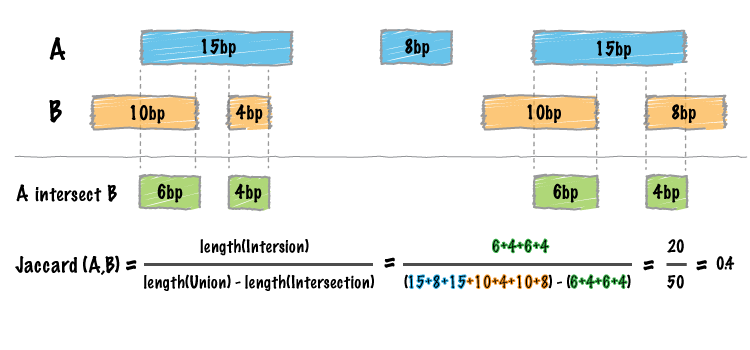

.. _jaccard:

###############
*jaccard*
###############

|

Whereas the bedtools ``intersect`` tool enumerates each an every intersection between two sets of genomic
intervals, one often needs a single statistic reflecting the *similarity* of the two sets based on the
intersections between them. The Jaccard statistic is used in set theory to represent the ratio of the 
intersection of two sets to the union of the two sets. Similarly, Favorov et al [1] reported the use
of the Jaccard statistic for genome intervals: specifically, it measures the ratio of the number of
intersecting base pairs between two sets to the number of base pairs in the union of the two sets.
The bedtools jaccard tool implements this statistic, yet modifies the statistic such that the length of the 
intersection is subtracted from the length of the union. As a result, the final statistic ranges from 0.0
to 1.0, where 0.0 represents no overlap and 1.0 represent complete overlap.

.. code::

    [1] Exploring Massive, Genome Scale Datasets with the GenometriCorr Package. 
    Favorov A, Mularoni L, Cope LM, Medvedeva Y, Mironov AA, et al. (2012) 
    PLoS Comput Biol 8(5): e1002529. doi:10.1371/journal.pcbi.1002529

.. note::

    The ``jaccard`` tool requires that your data is pre-sorted by chromosome and
    then by start position (e.g., ``sort -k1,1 -k2,2n in.bed > in.sorted.bed``
    for BED files).

.. seealso::

    :doc:`../tools/reldist`
    :doc:`../tools/intersect`
    

===============================
Usage and option summary
===============================
**Usage**:
::

  bedtools jaccard [OPTIONS] -a <BED/GFF/VCF> -b <BED/GFF/VCF>

===========================    =========================================================================================================================================================
Option                         Description
===========================    =========================================================================================================================================================
**-a**                           BED/GFF/VCF file A. Each feature in A is compared to B in search of overlaps. Use "stdin" if passing A with a UNIX pipe.
**-b**                           BED/GFF/VCF file B. Use "stdin" if passing B with a UNIX pipe.
**-f**                         Minimum overlap required as a fraction of A. Default is 1E-9 (i.e. 1bp).
**-F**                         Minimum overlap required as a fraction of B. Default is 1E-9 (i.e., 1bp).
**-r**                         Require that the fraction of overlap be reciprocal for A and B. In other words, if -f is 0.90 and -r is used, this requires that B overlap at least 90% of A and that A also overlaps at least 90% of B.
**-e**                         Require that the minimum fraction be satisfied for A _OR_ B. In other words, if -e is used with -f 0.90 and -F 0.10 this requires that either 90% of A is covered OR 10% of  B is covered. Without -e, both fractions would have to be satisfied.**-s**                         Force "strandedness". That is, only report hits in B that overlap A on the same strand. By default, overlaps are reported without respect to strand.
**-S**                         Require different strandedness.  That is, only report hits in B that overlap A on the _opposite_ strand. By default, overlaps are reported without respect to strand.
**-split**                     Treat "split" BAM (i.e., having an "N" CIGAR operation) or BED12 entries as distinct BED intervals.
===========================    =========================================================================================================================================================

===============================
Default behavior
===============================
By default, ``bedtools jaccard`` reports the length of the intersection, the length of the union (minus the intersection), 
the final Jaccard statistic reflecting the similarity of the two sets, as well as the number of intersections.

.. code-block:: bash

  $ cat a.bed
  chr1  10  20
  chr1  30  40

  $ cat b.bed
  chr1  15   20

  $ bedtools jaccard -a a.bed -b b.bed
  intersection	union	jaccard	n_intersections
  5	20	0.25	1

============================================
Controlling which intersections are included
============================================
One can also control which intersections are included in the statistic by requiring a certain fraction of overlap
with respect to the features in A (via the ``-f`` parameter) or also by requiring that the fraction of overlap is
reciprocal (``-r``) in A and B.

.. code-block:: bash

  $ cat a.bed
  chr1  10  20
  chr1  30  40

  $ cat b.bed
  chr1  15   20

Require 10% overlap with respect to the intervals in A:

.. code-block:: bash

  $ bedtools jaccard -a a.bed -b b.bed -f 0.1
  intersection  union   jaccard n_intersections
  5 20  0.25    1

Require 60% overlap with respect to the intervals in A:

.. code-block:: bash

  $ bedtools jaccard -a a.bed -b b.bed -f 0.6
  intersection  union   jaccard n_intersections
  0 25  0.25    0

