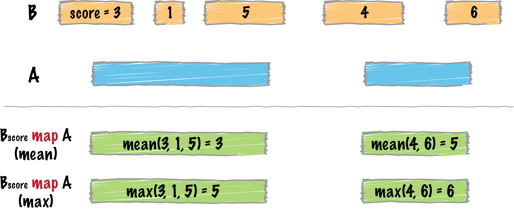
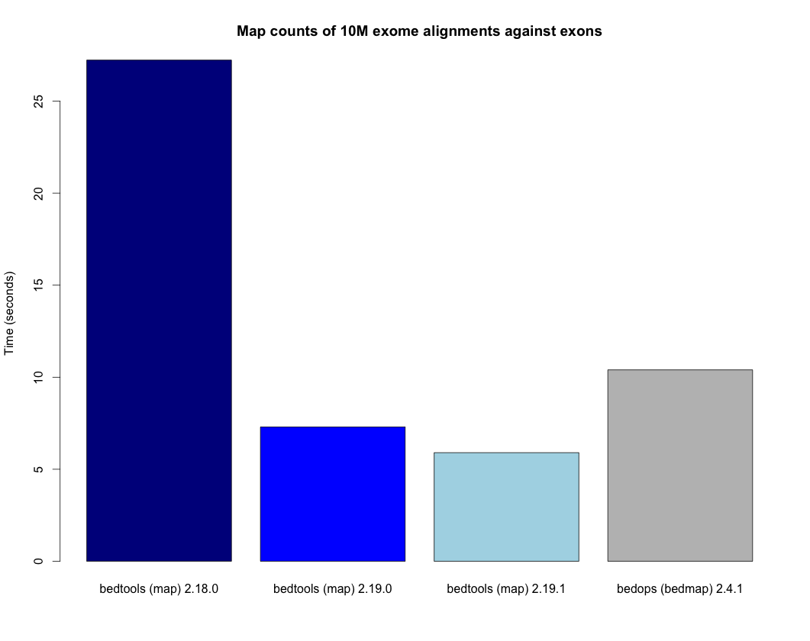

.. _map:

###############
*map*
###############

|

|

``bedtools map`` allows one to map overlapping features in a B file onto 
features in an A file and apply statistics and/or summary operations on those 
features.  

For example, one could use ``bedtools map`` to compute the average
score of BEDGRAPH records that overlap genes. Since the fourth column in 
BEDGRAPH is the score, the following command illustrates how this would be done:

.. code-block:: bash

    $ bedtools map -a genes.bed -b peaks.bedgraph -c 4 -o mean

Another example is discussed in this Biostars 
`post <http://www.biostars.org/p/61653/>`_.

.. note::

    ``bedtools map`` requires each input file to be sorted by genome coordinate.
    For BED files, this can be done with ``sort -k1,1 -k2,2n``. Other sorting criteria are allowed if a genome file (`-g`) is provides that specifies the expected chromosome order.

.. note::

    The ``map`` tool is substantially faster in versions 2.19.0 and later. The plot below demonstrates the increased speed when, for example, counting the number of exome alignments that align to each exon. The bedtools times are compared to the bedops `bedmap` utility as a point of reference.

|

|

==========================================================================
Usage and option summary
==========================================================================
**Usage**:
::

  bedtools map [OPTIONS] -a <bed/gff/vcf> -b <bed/gff/vcf>

**(or)**:
::

  mapBed [OPTIONS] -a <bed/gff/vcf> -b <bed/gff/vcf>
  
  
===========================      ===============================================================================================================================================================================================================
Option                           Description
===========================      ===============================================================================================================================================================================================================
**-c**                           | Specify the column from the B file to map onto intervals in A.
                                 | ``Default: 5``

**-o**                           Specify the operation that should be applied to ``-c``.

                                 | Valid operations: 
                                 
                                 | **sum** - *numeric only*
                                 | **count** - *numeric or text*
                                 | **count_distinct** - *numeric or text*
                                 | **min** - *numeric only*
                                 | **max** - *numeric only*
                                 | **absmin** - *numeric only*
                                 | **absmax** - *numeric only*
                                 | **mean** - *numeric only*
                                 | **median** - *numeric only*
                                 | **antimode** - *numeric or text*
                                 | **collapse** (i.e., print a comma separated list) - *numeric or text*
                                 | **distinct** (i.e., print a comma separated list) - *numeric or text*
                                 | **concat** (i.e., print a comma separated list) - *numeric or text*

**-f**                           Minimum overlap required as a fraction of A. Default is 1E-9 (i.e. 1bp).
**-F**                           Minimum overlap required as a fraction of B. Default is 1E-9 (i.e., 1bp).
**-r**                           Require that the fraction of overlap be reciprocal for A and B. In other words, if -f is 0.90 and -r is used, this requires that B overlap at least 90% of A and that A also overlaps at least 90% of B.
**-e**                           Require that the minimum fraction be satisfied for A _OR_ B. In other words, if -e is used with -f 0.90 and -F 0.10 this requires that either 90% of A is covered OR 10% of  B is covered. Without -e, both fractions would have to be satisfied.
**-s**		                     Force "strandedness". That is, only report hits in B that overlap A on the same strand. By default, overlaps are reported without respect to strand.
**-S**	                         Require different strandedness.  That is, only report hits in B that overlap A on the _opposite_ strand. By default, overlaps are reported without respect to strand.
**-null**                        | The value to print if no overlaps are found for an A interval.
                                 | ``Default: "."``

**-header**	                     Print the header from the A file prior to results.
**-split**                       Treat "split" BAM (i.e., having an "N" CIGAR operation) or BED12 entries as distinct BED intervals.
                                 When using -sorted, memory usage remains low even for very large files.
**-g**                           Specify a genome file the defines the expected chromosome order in the input files.
===========================      ===============================================================================================================================================================================================================

================================================================================
Default behavior - compute the ``sum`` of the ``score`` column for all overlaps.
================================================================================
By default, ``map`` computes the sum of the 5th column (the ``score`` field for
BED format) for all intervals in B that overlap each interval in A.

.. tip::

    Records in A that have no overlap will, by default, return ``.`` for the
    computed value from B.  This can be changed with the ``-null`` option.

.. code-block:: bash

    $ cat a.bed
    chr1	10	20	a1	1	+
    chr1	50	60	a2	2	-
    chr1	80	90	a3	3	-

    $ cat b.bed
    chr1	12	14	b1	2	+
    chr1	13	15	b2	5	-
    chr1	16	18	b3	5	+
    chr1	82	85	b4	2	-
    chr1	85	87	b5	3	+

    $ bedtools map -a a.bed -b b.bed 
    chr1	10	20	a1	1	+	12
    chr1	50	60	a2	2	-	.
    chr1	80	90	a3	3	-	5
    

================================================================================
``mean`` Compute the mean of a column from overlapping intervals
================================================================================

.. code-block:: bash

    $ cat a.bed
    chr1	10	20	a1	1	+
    chr1	50	60	a2	2	-
    chr1	80	90	a3	3	-

    $ cat b.bed
    chr1	12	14	b1	2	+
    chr1	13	15	b2	5	-
    chr1	16	18	b3	5	+
    chr1	82	85	b4	2	-
    chr1	85	87	b5	3	+

    $ bedtools map -a a.bed -b b.bed -c 5 -o mean
    chr1	10	20	a1	1	+	4
    chr1	50	60	a2	2	-	.
    chr1	80	90	a3	3	-	2.5
    
    
================================================================================
``collapse`` List each value of a column from overlapping intervals
================================================================================

.. code-block:: bash

    $ bedtools map -a a.bed -b b.bed -c 5 -o collapse
    chr1	10	20	a1	1	+	2,5,5
    chr1	50	60	a2	2	-	.
    chr1	80	90	a3	3	-	2,3
    

================================================================================
``distinct`` List each *unique* value of a column from overlapping intervals
================================================================================

.. code-block:: bash

    $ bedtools map -a a.bed -b b.bed -c 5 -o distinct
    chr1	10	20	a1	1	+	2,5
    chr1	50	60	a2	2	-	.
    chr1	80	90	a3	3	-	2,3
    
================================================================================
``-s`` Only include intervals that overlap on the *same* strand.
================================================================================

.. code-block:: bash

    $ bedtools map -a a.bed -b b.bed -c 5 -o collapse -s
    chr1	10	20	a1	1	+	2,5
    chr1	50	60	a2	2	-	.
    chr1	80	90	a3	3	-	2
    
================================================================================
``-S`` Only include intervals that overlap on the *opposite* strand.
================================================================================

.. code-block:: bash

    $ bedtools map -a a.bed -b b.bed -c 5 -o collapse -S
    chr1	10	20	a1	1	+	5
    chr1	50	60	a2	2	-	.
    chr1	80	90	a3	3	-	3

================================================================================
Multiple operations and columns at the same time.
================================================================================

As of version 2.19.1, multiple columns and operations are allowed at the same time in a single run. This greatly expedites analyses by preventing one from having to process the same file over an over for each column/operation.

.. code-block:: bash

    $ bedtools map -a a.bed -b b.bed -c 5,5,5,5 -o min,max,median,collapse

Or, apply the same function to multiple columns:

.. code-block:: bash

    $ bedtools map -a a.bed -b b.bed -c 3,4,5,6 -o mean

