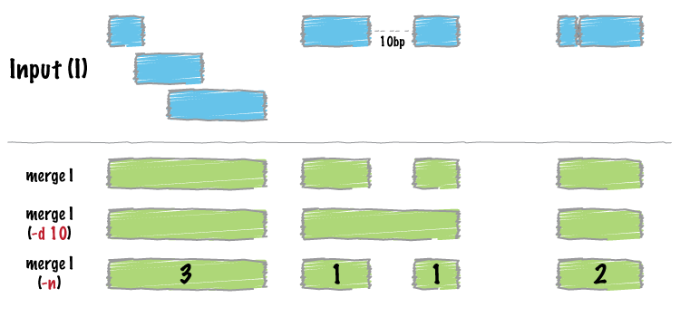

.. _merge:

###############
*merge*
###############

|

|

``bedtools merge`` combines overlapping or "book-ended" features in an interval 
file into a single feature which spans all of the combined features.

.. note::

    ``bedtools merge`` requires that you presort your data by chromosome and
    then by start position (e.g., ``sort -k1,1 -k2,2n in.bed > in.sorted.bed``
    for BED files).
    
.. seealso::

    :doc:`../tools/cluster`
    :doc:`../tools/complement`
    

==========================================================================
Usage and option summary
==========================================================================
**Usage**:
::

  bedtools merge [OPTIONS] -i <BED/GFF/VCF/BAM> 

**(or)**:
::

  mergeBed [OPTIONS] -i <BED/GFF/VCF/BAM>

  
===========================      ===============================================================================================================================================================================================================
Option                           Description
===========================      ===============================================================================================================================================================================================================
**-s**				                   Force strandedness. That is, only merge features that are the same strand. *By default, this is disabled*.
**-S**                           Force merge for one specific strand only. Follow with + or - to force merge from only the forward or reverse strand, respectively. *By default, merging is done without respect to strand*.
**-d**                           Maximum distance between features allowed for features to be merged. *Default is 0. That is, overlapping and/or book-ended features are merged*.
**-c**                           Specify columns from the input file to operate upon (see -o option, below). Multiple columns can be specified in a comma-delimited list.
**-o**                           | Specify the operation that should be applied to ``-c``.
                                 | Valid operations:
                                 |     sum, min, max, absmin, absmax,
                                 |     mean, median,
                                 |     collapse (i.e., print a delimited list (duplicates allowed)),
                                 |     distinct (i.e., print a delimited list (NO duplicates allowed)),
                                 |     count
                                 |     count_distinct (i.e., a count of the unique values in the column),
                                 | **Default:** sum
                                 | Multiple operations can be specified in a comma-delimited list. 
                                 | If there is only column, but multiple operations, all operations will be
                                 | applied on that column. Likewise, if there is only one operation, but
                                 | multiple columns, that operation will be applied to all columns.
                                 | Otherwise, the number of columns must match the the number of operations,
                                 | and will be applied in respective order.
                                 |
                                 | E.g., ``-c 5,4,6 -o sum,mean,count`` will give the sum of column 5,
                                 | the mean of column 4, and the count of column 6.
                                 | The order of output columns will match the ordering given in the command.
**-header**                      | Print the header from the A file prior to results.

**-delim**                       | Specify a custom delimiter for the -nms and -scores concat options
                                 | Example: ``-delim "|"``
                                 | ``Default: ";"``
===========================      ===============================================================================================================================================================================================================

==========================================================================
Default behavior
==========================================================================
By default, ``bedtools merge`` combines overlapping (by at least 1 bp) and/or
bookended intervals into a single, "flattened" or "merged" interval.
  
.. code-block:: bash

  $ cat A.bed
  chr1  100  200
  chr1  180  250
  chr1  250  500
  chr1  501  1000

  $ bedtools merge -i A.bed
  chr1  100  500
  chr1  501  1000

==========================================================================
``-s`` Enforcing "strandedness" 
==========================================================================
The ``-s`` option will only merge intervals that are overlapping/bookended
*and* are on the same strand.

.. code-block:: bash

  $ cat A.bed
  chr1  100  200   a1  1 +
  chr1  180  250   a2  2 +
  chr1  250  500   a3  3 - 
  chr1  501  1000  a4  4 +

  $ bedtools merge -i A.bed -s
  chr1  100  250
  chr1  501  1000
  chr1  250  500

To also report the strand, you could use the ``-c`` and ``-o`` operators (see below for more details):

.. code-block:: bash

  $ bedtools merge -i A.bed -s -c 6 -o distinct
  chr1  100 250 +
  chr1  501 1000  +

==========================================================================
``-S`` Reporting merged intervals on a specific strand. 
==========================================================================
The ``-S`` option will only merge intervals for a specific strand. For example,
to only report merged intervals on the "+" strand:

.. code-block:: bash

  $ cat A.bed
  chr1  100  200   a1  1 +
  chr1  180  250   a2  2 +
  chr1  250  500   a3  3 - 
  chr1  501  1000  a4  4 +

  $ bedtools merge -i A.bed -S + 
  chr1  100 250
  chr1  501 1000

To also report the strand, you could use the ``-c`` and ``-o`` operators (see below for more details):

.. code-block:: bash

  $ bedtools merge -i A.bed -S + -c 6 -o distinct
  chr1  100 250 +
  chr1  501 1000  +

==========================================================================
``-d`` Controlling how close two features must be in order to merge 
==========================================================================
By default, only overlapping or book-ended features are combined into a new 
feature. However, one can force ``merge`` to combine more distant features 
with the ``-d`` option. For example, were one to set ``-d`` to 1000, any 
features that overlap or are within 1000 base pairs of one another will be 
combined.

.. code-block:: bash

  $ cat A.bed
  chr1  100  200
  chr1  501  1000
  
  $ bedtools merge -i A.bed
  chr1  100  200
  chr1  501  1000

  $ bedtools merge -i A.bed -d 1000
  chr1  100  200  1000

==========================================================================
``-c`` and ``-o`` Applying operations to columns from merged intervals. 
==========================================================================
When merging intervals, we often want to summarize or keep track of the 
values observed in specific columns (e.g., the feature name or score) from
the original, unmerged intervals. When used together, the ``-c`` and ``-o``
options allow one to select specific columns (``-c``) and apply operation 
(``-o``) to each column. The result will be appended to the default, merged
interval output.  For example, one could use the following to report the
count of intervals that we merged in each resulting interval (this replaces
the ``-n`` option that existed prior to version ``2.20.0``).

.. code-block:: bash

  $ cat A.bed
  chr1  100  200
  chr1  180  250
  chr1  250  500
  chr1  501  1000
  
  $ bedtools merge -i A.bed -c 1 -o count
  chr1  100  500  3
  chr1  501  1000 1

We could also use these options to report the mean of the score (#5) field:

.. code-block:: bash

  $ cat A.bed
  chr1  100  200   a1  1 +
  chr1  180  250   a2  2 +
  chr1  250  500   a3  3 - 
  chr1  501  1000  a4  4 +

  $ bedtools merge -i A.bed -c 5 -o mean
  chr1  100 500 2
  chr1  501 1000  4

Let's get fancy and report the mean, min, and max of the score column:

.. code-block:: bash

  $ bedtools merge -i A.bed -c 5 -o mean,min,max
  chr1  100 500 2 1 3
  chr1  501 1000  4 4 4

Let's also report a comma-separated list of the strands:

.. code-block:: bash

  $ bedtools merge -i A.bed -c 5,5,5,6 -o mean,min,max,collapse
  chr1  100 500 2 1 3 +,+,-
  chr1  501 1000  4 4 4 +

Hopefully this provides a clear picture of what can be done.

==========================================================================
``-n`` Reporting the number of features that were merged 
==========================================================================
.. deprecated:: 2.20.0
See the ``-c`` and ``-o`` operators.

==========================================================================
``-nms`` Reporting the names of the features that were merged 
==========================================================================
.. deprecated:: 2.20.0
See the ``-c`` and ``-o`` operators.
  
==========================================================================
``-scores`` Reporting the scores of the features that were merged 
==========================================================================
.. deprecated:: 2.20.0
See the ``-c`` and ``-o`` operators.
  
  
==========================================================================
``-delim`` Change the delimiter for ``-c`` and ``-o``
==========================================================================
One can override the use of a comma as the delimiter for the ``-c`` and
``-o collapse|distinct`` options via the use of the ``-delim`` option.

.. code-block:: bash

  $ cat A.bed
  chr1  100  200  A1
  chr1  150  300  A2
  chr1  250  500  A3

Compare:
 
.. code-block:: bash

  $ bedtools merge -i A.bed -c 4 -o collapse
  chr1  100  500  A1,A2,A3
  
to:

.. code-block:: bash

  $ bedtools merge -i A.bed -c 4 -o collapse -delim "|"
  chr1  100  500  A1|A2|A3
