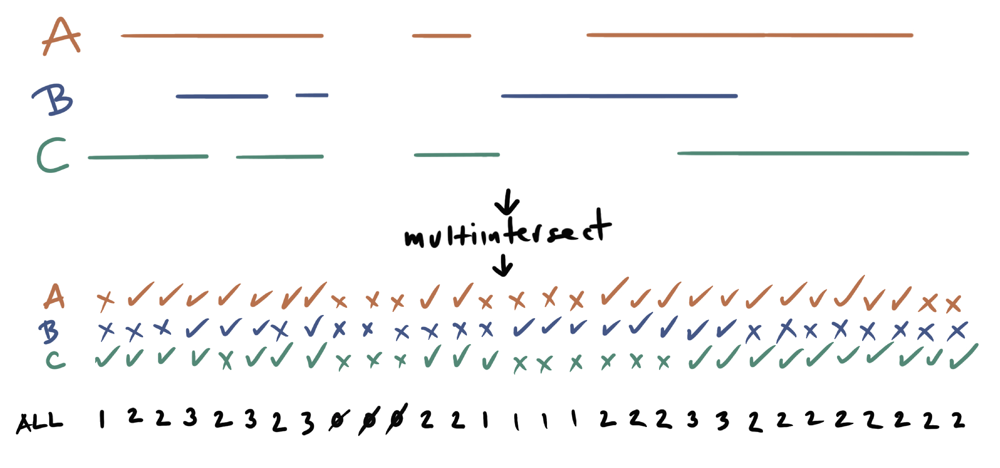

.. _multiinter:

###############
*multiinter*
###############

|

|

``bedtools multiinter`` identifies common intervals among multiple (and subsets thereof)
	 sorted BED/GFF/VCF files. 

.. note::

  1. All files must be sorted in the same mmanner (e.g., ``sort -k 1,1 -k2,2n in.bed > in.sorted.bed``)

===============================
Usage and option summary
===============================
**Usage**:
::

  bedtools multiinter [OPTIONS] -i FILE1 FILE2 .. FILEn

**(or)**:
::

  multiIntersect [OPTIONS]  -i FILE1 FILE2 .. FILEn

===========================      ===============================================================================================================================================================================================================
 Option                           Description
===========================      ===============================================================================================================================================================================================================
**-header**                      Print a header line (chrom/start/end + names of each file).
**-names**                       A list of names (one/file) to describe each file in -i.
			                     These names will be printed in the header line.
**-g**                           Use genome file to calculate empty regions.
**-empty**                       | Report empty regions (i.e., start/end intervals w/o
			                     | values in all files). Requires the '-g FILE' parameter.
**-filler TEXT**                 | Use TEXT when representing intervals having no value.
			                     | Default is '0', but you can use 'N/A' or any text.
**-examples**                    Show usage examples on the command line.
===========================      ===============================================================================================================================================================================================================

==========================================================================
Default behavior
==========================================================================
By default, ``bedtools multiinter`` will inspect all of the intervals in each input file and
report the sub-intervals that are overlapped by 0, 1, 2, ... N files.
The default output format is as follows:

1. chromosome (or entire genome)
2. 0-based start coordinate of the sub-interval.
3. 1-based end coordinate of the sub-interval.
4. The number of files whose intervals overlap this sub interval at least once.
5. The list of file numbers (by order on the command line) whose intervals overlap this sub interval at least once.
6. Columns reflecting whether each file had (1) or did not have (0) 1 or more intervals overlapping this sub interval.

For example:

.. code-block:: bash

    $ cat a.bed
    chr1  6   12
    chr1  10  20
    chr1  22  27
    chr1  24  30
    
    cat b.bed
    chr1  12  32
    chr1  14  30

    $ cat c.bed
    chr1  8   15
    chr1  10  14
    chr1  32  34

    $ cat sizes.txt
    chr1  5000

    $ bedtools multiinter -i a.bed b.bed c.bed
    chr1	6	8	1	1	1	0	0
    chr1	8	12	2	1,3	1	0	1
    chr1	12	15	3	1,2,3	1	1	1
    chr1	15	20	2	1,2	1	1	0
    chr1	20	22	1	2	0	1	0
    chr1	22	30	2	1,2	1	1	0
    chr1	30	32	1	2	0	1	0
    chr1	32	34	1	3	0	0	1

 
==========================================================================
``-header`` Add a header with columns names
==========================================================================
For example:

.. code-block:: bash

    $ bedtools multiinter -header -i a.bed b.bed c.bed
    chrom	start	end	num	list	a.bed	b.bed	c.bed
    chr1	6	8	1	1	1	0	0
    chr1	8	12	2	1,3	1	0	1
    chr1	12	15	3	1,2,3	1	1	1
    chr1	15	20	2	1,2	1	1	0
    chr1	20	22	1	2	0	1	0
    chr1	22	30	2	1,2	1	1	0
    chr1	30	32	1	2	0	1	0
    chr1	32	34	1	3	0	0	1

==========================================================================
``-names`` Add custom labels for each file in the header
==========================================================================

For example:

.. code-block:: bash

    $ bedtools multiinter -header -names A B C -i a.bed b.bed c.bed
    chrom	start	end	num	list	A	B	C
    chr1	6	8	1	1	1	0	0
    chr1	8	12	2	1,3	1	0	1
    chr1	12	15	3	1,2,3	1	1	1
    chr1	15	20	2	1,2	1	1	0
    chr1	20	22	1	2	0	1	0
    chr1	22	30	2	1,2	1	1	0
    chr1	30	32	1	2	0	1	0
    chr1	32	34	1	3	0	0	1

==========================================================================
``-empty`` Report the sub intervals not covered by any file
==========================================================================
Note that this option requires a ``-g`` file so that it knows the full 
range of each chromosome or contig.

For example:

.. code-block:: bash
  
  $ bedtools multiinter -header -names A B C -i a.bed b.bed c.bed -empty -g sizes.txt
 chrom	start	end	num	list	A	B	C
 chr1	0	6	0	none	0	0	0
 chr1	6	8	1	A	1	0	0
 chr1	8	12	2	A,C	1	0	1
 chr1	12	15	3	A,B,C	1	1	1
 chr1	15	20	2	A,B	1	1	0
 chr1	20	22	1	B	0	1	0
 chr1	22	30	2	A,B	1	1	0
 chr1	30	32	1	B	0	1	0
 chr1	32	34	1	C	0	0	1
 chr1	34	5000	0	none	0	0	0
