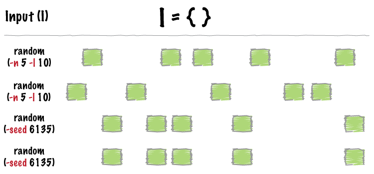

.. _random:

###############
*random*
###############

|

|

`bedtools random` will generate a random set of intervals in BED6 format. One
can specify both the number (``-n``) and the size (``-l``) of the intervals
that should be generated.

.. seealso::

    :doc:`../tools/shuffle`
    :doc:`../tools/jaccard`
    
    
==========================================================================
Usage and option summary
==========================================================================
**Usage**:

::

  bedtools random [OPTIONS] -g <GENOME>

**(or)**:
:
:

  randomBed [OPTIONS] -g <GENOME>

===========================      ===============================================================================================================================================================================================================
 Option                           Description
===========================      ===============================================================================================================================================================================================================
**-l**	                         | The length of the intervals to generate.
                                 | ``Default = 100``

**-n**	                         | The number of intervals to generate.
                                 | ``Default = 1,000,000``

**-seed**                        Supply an integer seed for the shuffling. This will allow feature shuffling experiments to be recreated exactly as the seed for the pseudo-random number generation will be constant. *By default, the seed is chosen automatically*.
===========================      ===============================================================================================================================================================================================================

==========================================================================
Default behavior
==========================================================================
By default, `bedtools random` generate 1 million intervals of length 100
placed randomly in the genome specificed with ``-g``.

.. code-block:: bash

  $ bedtools random -g hg19.genome
  chr2	87536758	87536858	1	100	-
  chrX	46051735	46051835	2	100	+
  chr18	5237041	5237141	3	100	-
  chr12	45809998	45810098	4	100	+
  chrX	42034890	42034990	5	100	-
  chr10	77510935	77511035	6	100	-
  chr3	39844278	39844378	7	100	-
  chr6	101012700	101012800	8	100	+
  chr12	38123482	38123582	9	100	+
  chr7	88508598	88508698	10	100	-
  
  $ bedtools random -g hg19.genome
  chr3	141987850	141987950	1	100	+
  chr5	137643331	137643431	2	100	+
  chr2	155523858	155523958	3	100	-
  chr5	147874094	147874194	4	100	+
  chr1	71838335	71838435	5	100	-
  chr8	71154323	71154423	6	100	-
  chr2	133240474	133240574	7	100	+
  chr9	131495427	131495527	8	100	+
  chrX	125952943	125953043	9	100	+
  chr3	59685545	59685645	10	100	+

==========================================================================
``-n`` Specify the *number* of intervals to generate.
==========================================================================
The `-n` option allows one to override the default of generating 1 million 
intervals.

.. code-block:: bash

  $ bedtools random -g hg19.genome -n 3
  chr20	47975280	47975380	1	100	-
  chr16	23381222	23381322	2	100	+
  chr3	104913816	104913916	3	100	-

==========================================================================
``-l`` Specify the *length* of intervals to generate.
==========================================================================
The `-l` option allows one to override the default interval length of 100bp.

.. code-block:: bash

  $ bedtools random -g hg19.genome -l 5
  chr9	54133731	54133736	1	5	+
  chr1	235288830	235288835	2	5	-
  chr8	26744718	26744723	3	5	+
  chr3	187313616	187313621	4	5	-
  chr11	88996846	88996851	5	5	-
  chr13	84714855	84714860	6	5	-
  chr13	10759738	10759743	7	5	-
  chr6	122569739	122569744	8	5	+
  chr17	50884025	50884030	9	5	-
  chr11	38576901	38576906	10	5	+

==========================================================================
``-seed`` Defining a "seed" for the random interval creation.
==========================================================================
`bedtools random` uses a pseudo-random number generator to permute the 
locations of BED features. Therefore, each run should produce a different 
result. This can be problematic if one wants to exactly recreate an experiment. 
By using the `seed` option, one can supply a custom integer seed for
`bedtools random`. In turn, each execution of `bedtools random` with the same 
seed and input files should produce identical results.

.. code-block:: bash

  $ bedtools random -g hg19.genome -seed 71346
  chrY	23380696	23380796	1	100	-
  chr14	94368315	94368415	2	100	+
  chr14	45353323	45353423	3	100	-
  chr14	100546766	100546866	4	100	-
  chr12	43294368	43294468	5	100	-
  chr1	141470585	141470685	6	100	-
  chr10	31273665	31273765	7	100	+
  chr5	19102979	19103079	8	100	+
  chr3	116730634	116730734	9	100	-
  chr3	101222965	101223065	10	100	-
  
  # (same seed, thus same as above)
  $ bedtools random -g hg19.genome -seed 71346
  chrY	23380696	23380796	1	100	-
  chr14	94368315	94368415	2	100	+
  chr14	45353323	45353423	3	100	-
  chr14	100546766	100546866	4	100	-
  chr12	43294368	43294468	5	100	-
  chr1	141470585	141470685	6	100	-
  chr10	31273665	31273765	7	100	+
  chr5	19102979	19103079	8	100	+
  chr3	116730634	116730734	9	100	-
  chr3	101222965	101223065	10	100	-

