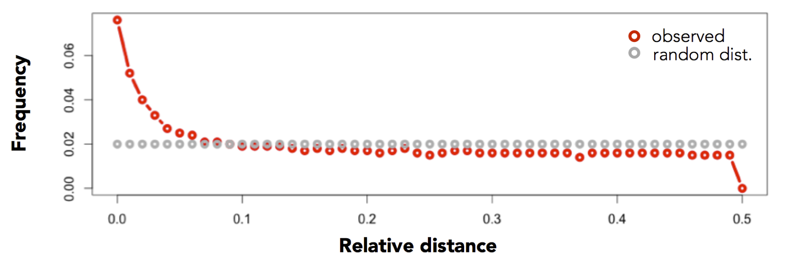

.. _reldist:

###############
*reldist*
###############

|

Traditional approaches to summarizing the similarity between two sets of genomic intervals 
are based upon the number or proportion of *intersecting* intervals. However, such measures
are largely blind to spatial correlations between the two sets where, despite consistent spacing
or proximity, intersections are rare (for example, enhancers and transcription start sites rarely overlap,
yet they are much closer to one another than two sets of random intervals). Favorov et al [1] proposed
a *relative distance* metric that describes distribution of relative distances between each interval in 
one set and the two closest intervals in another set (see figure above). If there is no spatial
correlation between the two sets, one would expect the relative distances to be uniformly distributed
among the relative distances ranging from 0 to 0.5. If, however, the intervals tend to be much closer than expected 
by chance, the distribution of observed relative distances would be shifted towards low relative distance values (e.g., the figure below).

.. code::

    [1] Exploring Massive, Genome Scale Datasets with the GenometriCorr Package. 
    Favorov A, Mularoni L, Cope LM, Medvedeva Y, Mironov AA, et al. (2012) 
    PLoS Comput Biol 8(5): e1002529. doi:10.1371/journal.pcbi.1002529

.. seealso::

    :doc:`../tools/jaccard`
    :doc:`../tools/closest`
    

===============================
Usage and option summary
===============================
**Usage**:
::

  bedtools reldist [OPTIONS] -a <BED/GFF/VCF> -b <BED/GFF/VCF>

===========================    =========================================================================================================================================================
Option                         Description
===========================    =========================================================================================================================================================
**-a**                           BED/GFF/VCF file A. Each feature in A is compared to B in search of overlaps. Use "stdin" if passing A with a UNIX pipe.
**-b**                           BED/GFF/VCF file B. Use "stdin" if passing B with a UNIX pipe.
**-detail**                      Instead of a summary, report the relative distance for each interval in A
===========================    =========================================================================================================================================================

===============================
Default behavior
===============================
By default, ``bedtools reldist`` reports the distribution of relative distances between two sets of intervals.
The output reports the frequency of each relative distance (ranging from 0.0 to 0.5). If the two sets of intervals
are randomly distributed with respect to one another, each relative distance "bin" with be roughly equally represented
(i.e., a uniform distribution). For example, consider the relative distance distance distribution for exons and AluY
elements:

.. code-block:: bash

  $ bedtools reldist \
      -a data/refseq.chr1.exons.bed.gz \
      -b data/
      aluY.chr1.bed.gz
  0.00  164 43408 0.004
  0.01  551 43408 0.013
  0.02  598 43408 0.014
  0.03  637 43408 0.015
  0.04  793 43408 0.018
  0.05  688 43408 0.016
  0.06  874 43408 0.020
  0.07  765 43408 0.018
  0.08  685 43408 0.016
  0.09  929 43408 0.021
  0.10  876 43408 0.020
  0.11  959 43408 0.022
  0.12  860 43408 0.020
  0.13  851 43408 0.020
  0.14  903 43408 0.021
  0.15  893 43408 0.021
  0.16  883 43408 0.020
  0.17  828 43408 0.019
  0.18  917 43408 0.021
  0.19  875 43408 0.020
  0.20  897 43408 0.021
  0.21  986 43408 0.023
  0.22  903 43408 0.021
  0.23  944 43408 0.022
  0.24  904 43408 0.021
  0.25  867 43408 0.020
  0.26  943 43408 0.022
  0.27  933 43408 0.021
  0.28  1132  43408 0.026
  0.29  881 43408 0.020
  0.30  851 43408 0.020
  0.31  963 43408 0.022
  0.32  950 43408 0.022
  0.33  965 43408 0.022
  0.34  907 43408 0.021
  0.35  884 43408 0.020
  0.36  965 43408 0.022
  0.37  944 43408 0.022
  0.38  911 43408 0.021
  0.39  939 43408 0.022
  0.40  921 43408 0.021
  0.41  950 43408 0.022
  0.42  935 43408 0.022
  0.43  919 43408 0.021
  0.44  915 43408 0.021
  0.45  934 43408 0.022
  0.46  843 43408 0.019
  0.47  850 43408 0.020
  0.48  1006  43408 0.023
  0.49  937 43408 0.022

In contrast, consider the relative distance distribution observed between exons and conserved elements:

.. code-block:: bash

  $ bedtools reldist \
     -a data/refseq.chr1.exons.bed.gz \
     -b data/gerp.chr1.bed.gz
  reldist  count total fraction
  0.00  20629 43422 0.475
  0.01  2629  43422 0.061
  0.02  1427  43422 0.033
  0.03  985 43422 0.023
  0.04  897 43422 0.021
  0.05  756 43422 0.017
  0.06  667 43422 0.015
  0.07  557 43422 0.013
  0.08  603 43422 0.014
  0.09  487 43422 0.011
  0.10  461 43422 0.011
  0.11  423 43422 0.010
  0.12  427 43422 0.010
  0.13  435 43422 0.010
  0.14  375 43422 0.009
  0.15  367 43422 0.008
  0.16  379 43422 0.009
  0.17  371 43422 0.009
  0.18  346 43422 0.008
  0.19  389 43422 0.009
  0.20  377 43422 0.009
  0.21  411 43422 0.009
  0.22  377 43422 0.009
  0.23  352 43422 0.008
  0.24  334 43422 0.008
  0.25  315 43422 0.007
  0.26  370 43422 0.009
  0.27  330 43422 0.008
  0.28  330 43422 0.008
  0.29  280 43422 0.006
  0.30  309 43422 0.007
  0.31  326 43422 0.008
  0.32  287 43422 0.007
  0.33  294 43422 0.007
  0.34  306 43422 0.007
  0.35  307 43422 0.007
  0.36  309 43422 0.007
  0.37  271 43422 0.006
  0.38  293 43422 0.007
  0.39  311 43422 0.007
  0.40  331 43422 0.008
  0.41  320 43422 0.007
  0.42  299 43422 0.007
  0.43  327 43422 0.008
  0.44  321 43422 0.007
  0.45  326 43422 0.008
  0.46  306 43422 0.007
  0.47  354 43422 0.008
  0.48  365 43422 0.008
  0.49  336 43422 0.008
  0.50  38  43422 0.001

Moreover, if one compares the relative distances for one set against itself, every interval
should be expected to overlap an interval in the other set (itself). As such, the relative 
distances will all be 0.0:

.. code-block:: bash

  $ bedtools reldist \
      -a data/refseq.chr1.exons.bed.gz \
      -b data/refseq.chr1.exons.bed.gz
  reldist  count total fraction
  0.00  43424 43424 1.000

