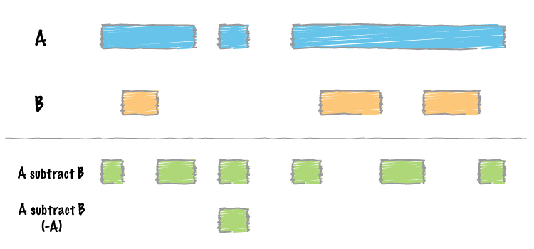

.. _subtract:

###############
*subtract*
###############

|

|

``bedtools subtract`` bedtools` subtract searches for features in B that overlap A by at least the number of base pairs given by the -f option. If an overlapping feature is found in B, the overlapping portion is removed from A and the remaining portion of A is reported. If a feature in B overlaps all of a feature in A, the A feature will not be reported. If a feature in B does not overlap a feature in A by at least the -f amount, the A feature will be reported in its entirety.

===============================
Usage and option summary
===============================
**Usage**:
::

  bedtools subtract [OPTIONS] -a <BED/GFF/VCF> -b <BED/GFF/VCF>

**(or)**:
::

  subtractBed [OPTIONS] -a <BED/GFF/VCF> -b <BED/GFF/VCF>

  
===========================      ===============================================================================================================================================================================================================
Option                           Description
===========================      ===============================================================================================================================================================================================================
**-f**                           Minimum overlap required as a fraction of A. Default is 1E-9 (i.e. 1bp).
**-F**                           Minimum overlap required as a fraction of B. Default is 1E-9 (i.e., 1bp).
**-r**                           Require that the fraction of overlap be reciprocal for A and B. In other words, if -f is 0.90 and -r is used, this requires that B overlap at least 90% of A and that A also overlaps at least 90% of B.
**-e**                           Require that the minimum fraction be satisfied for A _OR_ B. In other words, if -e is used with -f 0.90 and -F 0.10 this requires that either 90% of A is covered OR 10% of  B is covered. Without -e, both fractions would have to be satisfied.
**-s**                           Force "strandedness". That is, only report hits in B that overlap A on the same strand. By default, overlaps are reported without respect to strand.
**-S**	                         Require different strandedness.  That is, only report hits in B that overlap A on the _opposite_ strand. By default, overlaps are reported without respect to strand.
**-A**	                         Remove entire feature if any overlap.  That is, by default, only subtract the portion of A that overlaps B. Here, if any overlap is found (or ``-f`` amount), the entire feature is removed.
**-N**                           Same as -A except when used with -f, the amount is the sum of all features (not any single feature).
===========================      ===============================================================================================================================================================================================================

==========================================================================
Default behavior
========================================================================== 
By default, ``bedtools subtracts`` removes each overlapping interval in B
from A.  If a feature in B *completely* overlaps a feature in A, the A feature
is removed.

.. code-block:: bash

  $ cat A.bed
  chr1  10   20
  chr1  100  200

  $ cat B.bed
  chr1  0    30
  chr1  180  300

  $ bedtools subtract -a A.bed -b B.bed
  chr1  100  180
  
  
  
  
  

==========================================================================
``-f`` Requiring a minimal overlap fraction before subtracting
==========================================================================
This option behaves the same as the ``-f`` option for ``bedtools intersect``. 
In this case, ``subtract`` will only subtract an overlap with B if it covers at 
least the fraction of A defined by ``-f``. If an overlap is found,
but it does not meet the overlap fraction, the original A feature is 
reported without subtraction.

.. code-block:: bash

  $ cat A.bed
  chr1  100  200

  $ cat B.bed
  chr1  180  300

  $ bedtools subtract -a A.bed -b B.bed -f 0.10
  chr1  100  180

  $ bedtools subtract -a A.bed -b B.bed -f 0.80
  chr1  100  200

==========================================================================
``-s`` Enforcing same "strandedness" 
==========================================================================
This option behaves the same as the ``-s`` option for ``bedtools intersect`` 
while scanning for features in B that should be subtracted from A. 

.. code-block:: bash

  $ cat A.bed
  chr1  100  200    a1  1   +

  $ cat B.bed
  chr1  80   120    b1  1   +  
  chr1  180  300    b2  1   -

  $ bedtools subtract -a A.bed -b B.bed -s
  chr1  120  200    a1  1   +
  

==========================================================================
``-S`` Enforcing opposite "strandedness" 
==========================================================================
This option behaves the same as the ``-s`` option for ``bedtools intersect`` 
while scanning for features in B that should be subtracted from A. 

.. code-block:: bash

  $ cat A.bed
  chr1  100  200    a1  1   +

  $ cat B.bed
  chr1  80   120    b1  1   +  
  chr1  180  300    b2  1   -

  $ bedtools subtract -a A.bed -b B.bed -S
  chr1  100  180    a1  1   +
  

==========================================================================
``-A`` Remove features with any overlap
==========================================================================
Unlike the default behavior, the ``-A`` option will completely remove
a feature from A if it has even 1bp of overlap with a feature in B. 

.. code-block:: bash

  $ cat A.bed
  chr1  100  200

  $ cat B.bed
  chr1  180  300

  $ bedtools subtract -a A.bed -b B.bed
  chr1  100  180

  $ bedtools subtract -a A.bed -b B.bed -A

