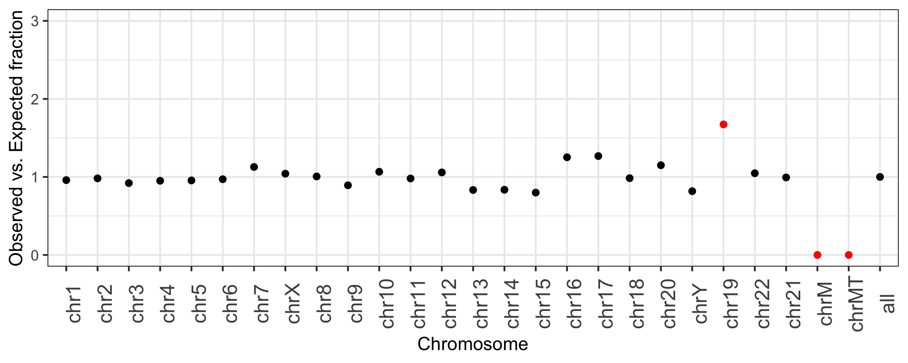

.. _summary:

###############
*summary*
###############

|

Genomics experiments have numerous sources of both technical and biological variation 
that can confound analysis and interpretation. Therefore, one of the most important steps
in genomics data analysis is generating high-level summary stats of one's data to ask if the 
basic observations align with the expectation.  Doing such quality control as early 
as possible in the analysis workflow helps to head off unnecessary time spent chasing 
technical artifacts that masquerade as biological signals.  **This quality control
is the motivation behind the** ``bedtools summary`` **command.**

Given an input interval file in standard formats, as well as a genome file defining
the chromosome names and lengths relevant to your data, ``bedtools summary`` will compute 
several summary statistics detailing, for each chromosome, the number of intervals, 
the total number of base pairs, and the fraction of intervals and base pairs observed 
in your input file. From these summary measures, one can get a quick sense of questions like:

    - Are all chromosomes represented in my data or annotation file?
    - Do all chromosomes have the expected number of intervals or fraction of base pairs represented?
    - Which chromosomes are outliers?

For example, the following plot was generated directly from the output of ``bedtools summary``.
It depicts, for each chromosome, the fraction of all intervals in the RepeatMasker track from UCSC
**observed** on each chromosome versus the fraction of RepeatMasker intervals that are **expected**
for each chromosome, based on the fraction of the genome that each chromosome represents.

This plot highlights that ``chr19``, ``chrM``, and ``chrMT`` (the different mitochondrial reference genomes) are outliers. 
Chromosome 19 has more than 1.5 times the intervals that are expected based upon the length of
the chromosome. ChrM has no intervals, making the observed-to-expected ratio be 0. 
This former is because the repeat content of chromosome 19 "is approximately 55%, more than 10% higher 
than the genome-wide average" (``Grimwood J, et al. Nature. 2004;428:529–35``). The latter is because
are indeed no repeat annotations provided by UCSC for the mitochondrial genome.

In this case, the extremes in observed versus expected ratios make sense. However,
**this tool allows one to detect cases that do not and are either artifacts or
biological signals**.

==========================================================================
Usage and option summary
==========================================================================
**Usage**:
::

  bedtools summary -i <BED/GFF/VCF> -g <GENOME>

===============================
Default behavior
===============================
``bedtools summary`` scans the input interval file and the chromosome lengths provided in 
the "genome" file and reports the following columns for each chromosome.

    #.	**chrom** (chromosome name)
    #.	**chrom_length** (the length of the chromosome in bp)
    #.	**num_ivls** (the total number of intervals observed for the chromosome)
    #.	**total_ivl_bp** (the total number of bp observed in the intervals for the chromosome)
    #.	**chrom_frac_genome** (the fraction of the genome represented by the chromosome)
    #.	**frac_all_ivls** (the fraction of all intervals observed the chromosome)
    #.	**frac_all_bp** (the fraction of all bp observed the chromosome)
    #.	**min** (the smallest interval observed on that chromosome)
    #.	**max** (the largest interval observed on that chromosome)
    #.	**mean** (the mean interval length observed on that chromosome)

In addition, ``bedtools summary`` reports a final line with the chromosome name "all", which
depicts the metrics above but tabulated across all chromosomes in the input file.

As an example, let's recreate the figure above by running ``bedtools summary`` on the 
simple repeats track from UCSC.  We'll begin by downloading the data in track the
track table and converting it to BED format. 

.. code-block:: bash

    curl -s http://hgdownload.soe.ucsc.edu/goldenPath/hg38/database/simpleRepeat.txt.gz  \
        | gzcat \
        | cut -f 2-5 \
        | grep -v -E 'Un|fix|random|alt|hap' \
        > simrep.grch38.bed

    head simrep.grch38.bed
    chr1	10000	10468	trf
    chr1	10627	10800	trf
    chr1	10757	10997	trf
    chr1	11225	11447	trf
    chr1	11271	11448	trf
    chr1	11283	11448	trf
    chr1	19305	19443	trf
    chr1	20828	20863	trf
    chr1	30862	30959	trf
    chr1	44835	44876	trf

Now, let's make a "genome" file for GRCh38 from the `chromInfo` table at UCSC

.. code-block:: bash

    curl -s http://hgdownload.soe.ucsc.edu/goldenPath/hg38/database/chromInfo.txt.gz \
        | gzcat \
        | cut -f 1-2 \
        | grep -v -E 'Un|fix|random|alt|hap' \
        > grch38.genome.txt

    head grch38.genome.txt
    chr1	248956422
    chr2	242193529
    chr3	198295559
    chr4	190214555
    chr5	181538259
    chr6	170805979
    chr7	159345973
    chrX	156040895
    chr8	145138636
    chr9	138394717

Now, let's run ``bedtools summary``.

.. code-block:: bash

    bedtools summary -i simrep.grch38.bed -g grch38.genome.txt | column -t
    chrom  chrom_length  num_ivls  total_ivl_bp  chrom_frac_genome  frac_all_ivls  frac_all_bp  min  max     mean
    chr1   248956422     74548     15557884      0.080613126        0.077210928    0.048725518  25   124438  208.696195740
    chr2   242193529     74474     14493548      0.078423273        0.077134284    0.045392139  25   336509  194.612186803
    chr3   198295559     56894     13946854      0.064208928        0.058926309    0.043679955  25   500000  245.137518895
    chr4   190214555     56685     10160257      0.061592265        0.058709844    0.031820766  25   136950  179.240663315
    chr5   181538259     53887     16801740      0.058782844        0.055811896    0.052621133  25   500000  311.795794904
    chr6   170805979     51802     11222841      0.055307687        0.053652418    0.035148658  25   500000  216.648797344
    chr7   159345973     55972     20054618      0.051596890        0.057971375    0.062808775  25   150228  358.297327235
    chrX   156040895     50432     27398336      0.050526692        0.052233481    0.085808462  25   500000  543.272842640
    chr8   145138636     45937     15650021      0.046996495        0.047577915    0.049014080  25   500000  340.684437382
    chr9   138394717     39329     10932158      0.044812786        0.040733870    0.034238272  25   159861  277.966843805
    chr11  135086622     41279     14127024      0.043741611        0.042753526    0.044244227  25   500000  342.232709126
    chr10  133797422     45074     11407694      0.043324163        0.046684087    0.035727596  25   110000  253.088121755
    chr12  133275309     44151     13878240      0.043155100        0.045728117    0.043465064  25   356015  314.335802134
    chr13  114364328     29907     9423815       0.037031646        0.030975307    0.029514313  25   110000  315.103989033
    chr14  107043718     27973     9245970       0.034661202        0.028972223    0.028957323  25   173523  330.531941515
    chr15  101991189     25557     9565023       0.033025172        0.026469921    0.029956561  25   110000  374.262354736
    chr16  90338345      35288     11959674      0.029251932        0.036548522    0.037456334  25   138208  338.916175470
    chr17  83257441      32093     16264416      0.026959106        0.033239393    0.050938295  25   132210  506.790141152
    chr18  80373285      23966     18684937      0.026025204        0.024822089    0.058519091  25   500000  779.643536677
    chr20  64444167      22608     12620160      0.020867290        0.023415580    0.039524901  25   500000  558.216560510
    chr19  58617616      30854     11391752      0.018980628        0.031956135    0.035677667  25   396802  369.214753355
    chrY   57227415      15130     4564760       0.018530475        0.015670458    0.014296307  25   227093  301.702577660
    chr22  50818468      16760     10691540      0.016455232        0.017358684    0.033484683  25   498537  637.920047733
    chr21  46709983      14911     9253172       0.015124887        0.015443636    0.028979879  25   499939  620.560123399
    chrM   16569         0         0             0.000005365        0.000000000    0.000000000  -1   -1      -1
    all    3088286401    965511    319296434     1.0                1.0            1.0          25   500000  330.702015824

Notice the following:

    1. There are 0 intervals reported for `chrM` or `chrMT`; therefore, the min, max, and mean are all "-1".
    2. The last line in the output is has an "genome" chromosome, meaning it is a summary of all of the chromosomes.

Using this report, there are many high-level sanity checks one can explore. For example, we can 
create the plot described above by saving the output to a file. 

.. code-block:: bash

    bedtools summary -i simrep.grch38.bed -g grch38.genome.txt > ~/simrep.summary.tsv

Now run following R code. (Sorry, I am not an R expert)

.. code-block:: R

    if (!require("dplyr")) install.packages("dplyr")
    if (!require("ggplot2")) install.packages("ggplot2")
    library(dplyr)
    library(ggplot2)

    x = read_tsv('~/simrep.summary.tsv')
    x = x %>% mutate(obs_v_exp = frac_all_ivls/chrom_frac_genome)

    p = ggplot(x) + 
    ylim(0,3) + 
    ylab("Observed vs. Expected fraction") + 
    xlab("Chromosome") +
    geom_point(aes(x=factor(chrom, level=chrom), 
                    y=obs_v_exp,
                    color=ifelse(obs_v_exp>1.5 | obs_v_exp<0.5, 'red', 'black'))) + 
    scale_color_identity() +
    theme_bw()
    p + theme(axis.text.x = element_text(size = 12, angle = 90))

