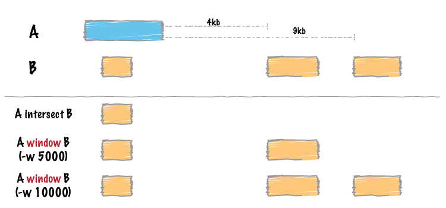

.. _window:

###############
*window*
###############

|

|

Similar to ``bedtools intersect``, ``window`` searches for overlapping features 
in A and B. However, ``window`` adds a specified number (1000, by default) of 
base pairs upstream and downstream of each feature in A. In effect, this allows 
features in B that are "near" features in A to be detected.

===============================
Usage and option summary
===============================
**Usage**:
::

  bedtools window [OPTIONS] [-a|-abam] -b <BED/GFF/VCF>

**(or)**:
::

  bedtools window [OPTIONS] [-a|-abam] -b <BED/GFF/VCF>

  
  
===========================      =========================================================================================================================================================
Option                           Description
===========================      =========================================================================================================================================================
**-abam**				         BAM file A. Each BAM alignment in A is compared to B in search of overlaps. Use "stdin" if passing A with a UNIX pipe: For example:  samtools view -b <BAM> | bedtools window -abam stdin -b genes.bed
**-ubam**					     Write uncompressed BAM output. The default is write compressed BAM output.
**-bed**					     When using BAM input (-abam), write output as BED. The default is to write output in BAM when using -abam. For example:  bedtools window -abam reads.bam -b genes.bed -bed                                              
**-w**					         Base pairs added upstream and downstream of each entry in A when searching for overlaps in B. *Default is 1000 bp*.
**-l**					         Base pairs added upstream (left of) of each entry in A when searching for overlaps in B. *Allows one to create asymmetrical "windows". Default is 1000bp*.
**-r**					         Base pairs added downstream (right of) of each entry in A when searching for overlaps in B. *Allows one to create asymmetrical "windows". Default is 1000bp*.
**-sw** 				         Define -l and -r based on strand. For example if used, -l 500 for a negative-stranded feature will add 500 bp downstream. *By default, this is disabled*.
**-sm** 				         Only report hits in B that overlap A on the same strand. *By default, overlaps are reported without respect to strand*.
**-Sm** 				         Only report hits in B that overlap A on the opposite strand. *By default, overlaps are reported without respect to strand*.
**-u**					         Write original A entry once if any overlaps found in B. In other words, just report the fact at least one overlap was found in B.
**-c**                           For each entry in A, report the number of hits in B while restricting to -w, -l, and -r. Reports 0 for A entries that have no overlap with B.							
**-v**                           Only report those entries in A that have *no overlaps* with B.
**-header**	                     Print the header from the A file prior to results.
===========================      =========================================================================================================================================================

==========================================================================
Default behavior
==========================================================================
By default, ``bedtools window`` adds 1000 bp upstream and downstream of each A 
feature and searches for features in B that overlap this "window". If an overlap 
is found in B, both the *original* A feature and the *original* B feature are 
reported. 

.. code-block:: bash

  $ cat A.bed
  chr1  100  200
  
  $ cat B.bed
  chr1  500  1000
  chr1  1300 2000
  
  $ bedtools window -a A.bed -b B.bed
  chr1  100  200  chr1  500  1000

==========================================================================
``-w`` Defining a custom window size 
==========================================================================
Instead of using the default window size of 1000bp, one can define a custom, 
*symmetric* window around each feature in A using the **-w** option. One should 
specify the window size in base pairs. For example, a window of 5kb should be 
defined as ``-w 5000``.

For example (note that in contrast to the default behavior, 
the second B entry is reported):

.. code-block:: bash

  $ cat A.bed
  chr1  100  200

  $ cat B.bed
  chr1  500  1000
  chr1  1300 2000

  $ bedtools window -a A.bed -b B.bed -w 5000
  chr1  100  200  chr1  500   1000
  chr1  100  200  chr1  1300  2000

==========================================================================
``-l and -r`` Defining *asymmetric* windows
==========================================================================
One can also define asymmetric windows where a differing number of bases are 
added upstream and downstream of each feature using the ``-l`` (upstream)
and ``-r`` (downstream)** options.

.. note::

    By default, the ``-l`` and ``-r`` options ignore strand.  If you want to define
    *upstream* and *downstream* based on strand, use the ``-sw`` option (below)
    with the ``-l`` and ``-r`` options.
    
For example (note the difference between -l 200 and -l 300):

.. code-block:: bash
  
  $ cat A.bed
  chr1  1000  2000
  
  $ cat B.bed
  chr1  500   800
  chr1  10000 20000
  
  $ bedtools window -a A.bed -b B.bed -l 200 -r 20000
  chr1  1000   2000  chr1  10000  20000
  
  $ bedtools window -a A.bed -b B.bed -l 300 -r 20000
  chr1  1000   2000  chr1  500    800
  chr1  1000   2000  chr1  10000  20000

  
==========================================================================
``-sw`` Defining asymmetric windows based on strand
==========================================================================
Especially when dealing with gene annotations or RNA-seq experiments, you may 
want to define asymmetric windows based on "strand". For example, you may want 
to screen for overlaps that occur within 5000 bp upstream of a gene (e.g. a 
promoter region) while screening only 1000 bp downstream of the gene. 
By enabling the ``-sw`` ("stranded" windows) option, the windows are added 
upstream or downstream according to strand. For example, imagine one 
specifies  ``-l 5000``, ``-r 1000`` as well as the ``-sw`` option. In this case, 
forward stranded ("+") features will screen 5000 bp to the *left* (that is, 
*lower* genomic coordinates) and 1000 bp to the *right* (that is, *higher* 
genomic coordinates). By contrast, reverse stranded ("-") features will screen 
5000 bp to the *right* (that is, *higher* genomic coordinates) and 1000 bp to 
the *left* (that is, *lower* genomic coordinates).

For example (note the difference between ``-l 200`` and ``-l 300``):

.. code-block:: bash

  $ cat A.bed
  chr1  10000  20000  A.forward  1  +
  chr1  10000  20000  A.reverse  1  -
  
  $ cat B.bed
  chr1  1000   8000   B1
  chr1  24000  32000  B2
  
  $ bedtools window -a A.bed -b B.bed -l 5000 -r 1000 -sw
  chr1  10000  20000  A.forward  1  +  chr1  1000   8000   B1
  chr1  10000  20000  A.reverse  1  -  chr1  24000  32000  B2
  

  
==========================================================================
``-sm`` Enforcing matches with the *same* "strandedness" 
==========================================================================
This option behaves the same as the ``-s`` option for ``bedtools intersect`` 
while scanning for overlaps within the "window" surrounding A. That is, overlaps 
in B will only be included if the B interval is on the *same* strand as the A
interval.

==========================================================================
``-Sm`` Enforcing matches with the *opposite* "strandedness" 
==========================================================================
This option behaves the same as the ``-S`` option for ``bedtools intersect`` while 
scanning for overlaps within the "window" surrounding A. That is, overlaps in
B will only be included if the B interval is on the *opposite* strand as the A
interval.

==========================================================================
``-u`` Reporting the presence/absence of at least one overlapping feature 
==========================================================================
This option behaves the same as for ``bedtools intersect``.  That is, even if
multiple overlaps exist, each A interval will only be reported once.

==========================================================================
``-c`` Reporting the number of overlapping features 
==========================================================================
This option behaves the same as for ``bedtools intersect``.  That is, it will 
report the *count* of intervals in B that overlap each A interval.

==========================================================================
``-v`` Reporting the absence of any overlapping features 
==========================================================================
This option behaves the same as for ``bedtools intersect``.  That is, it will 
only report those intervals in A that have have *zero* overlaps in B.

==========================================================================
``-header`` Print the header for the A file before reporting results.
==========================================================================
By default, if your A file has a header, it is ignored when reporting results.
This option will instead tell bedtools to first print the header for the
A file prior to reporting results.
