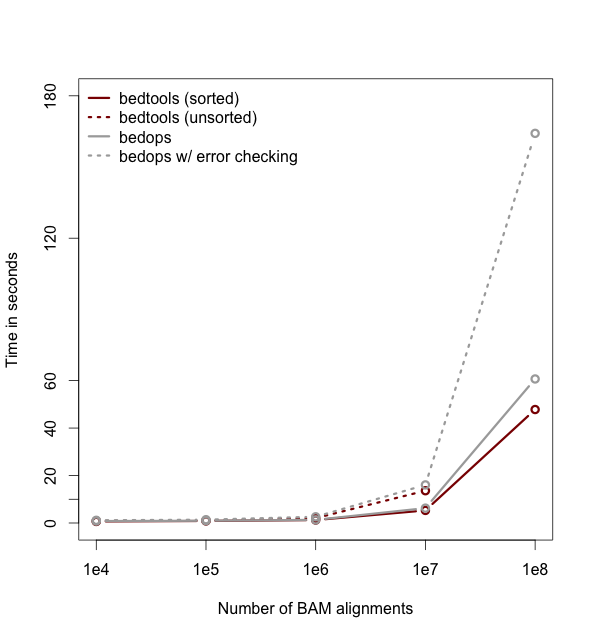

================================================================
**bedtools**: *a powerful toolset for genome arithmetic*
================================================================

Collectively, the **bedtools** utilities are a swiss-army knife of tools
for a wide-range of genomics analysis tasks. The most widely-used
tools enable *genome arithmetic*: that is, set theory on the genome.  For 
example, **bedtools** allows one to *intersect*, *merge*, *count*, *complement*,
and *shuffle* genomic intervals from multiple files in widely-used 
genomic file formats such as BAM, BED, GFF/GTF, VCF. While each individual tool is designed to do a relatively simple task (e.g., 
*intersect* two interval files), quite sophisticated analyses can be conducted
by combining multiple bedtools operations on the UNIX command line.

**bedtools** is developed in the `Quinlan laboratory <http://quinlanlab.org>`_ at the `University of Utah <http://www.utah.edu/>`_ and benefits from fantastic contributions made by scientists worldwide.

==========================
Tutorial
==========================
- We have developed a fairly comprehensive `tutorial <http://quinlanlab.org/tutorials/bedtools/bedtools.html>`_ that demonstrates both the basics, as well as some more advanced examples of how bedtools can help you in your research. Please have a look.
- Robert Aboukhalil has developed `sandbox.bio <https://sandbox.bio/>`_ an excellent, web-based playground for the bedtools tutorial and other widely-used genomics tools. 

==========================
Important notes
==========================
- As of version 2.28.0, bedtools now supports the CRAM format via the use of `htslib <https://github.com/samtools/htslib>`_. Specify the reference genome associated with your CRAM file via the CRAM_REFERENCE environment variable. Bedtools will look for this environment variable when it needs to access sequence data from the CRAM file (e.g., `bamtofastq`). 
- With the exception of BAM files, `bedtools` assumes all input files are TAB delimited.
- `bedtools` also assumes that all input files use UNIX line endings.
- Unless you use the `-sorted` option, `bedtools` currently does not support chromosomes larger than 512Mb
- When using the -sorted option with files whose chromosomes are not lexicographically sorted (e.g., sort -k1,1 -k2,2n for BED files), one must provide a genome file (`-g`) defining the expected chromosome order. 
- `bedtools` requires that chromosome naming schemes are identical in files that you are comparing (e.g., 'chr1' in one file and '1' in another won't work).
- .fai files may be used as genome (`-g`) files.

==========================
Interesting Usage Examples
==========================

In addition, here are a few examples of how bedtools has been used for genome research. If you have interesting examples, please send them our way and we will add them to the list.

- `Coverage analysis for targeted DNA capture <http://gettinggeneticsdone.blogspot.com/2014/03/visualize-coverage-exome-targeted-ngs-bedtools.html>`_. Thanks to `Stephen Turner <https://twitter.com/genetics_blog>`_.
- `Measuring similarity of DNase hypersensitivity among many cell types <https://github.com/arq5x/bedtools-protocols/blob/master/bedtools.md#bp6--measuring-dataset-similarity>`_
- `Extracting promoter sequences from a genome <http://www.biostars.org/p/17162/>`_
- `Comparing intersections among many genome interval files <http://www.biostars.org/p/13516/>`_
- `RNA-seq coverage analysis <http://www.cureffi.org/2013/11/18/an-mrna-seq-pipeline-using-gsnap-samtools-cufflinks-and-bedtools/>`_. Thanks to `Erik Minikel <https://twitter.com/cureffi>`_.
- `Identifying targeted regions that lack coverage <https://twitter.com/aaronquinlan/status/421786507511205888>`_. Thanks to `Brent Pedersen <https://twitter.com/brent_p>`_.
- `Calculating GC content for CCDS exons <http://www.biostars.org/p/47047/>`_.
- `Making a master table of ChromHMM tracks for multiple cell types <https://gist.github.com/arq5x/3138599>`_.

=================
Table of contents
=================
.. toctree::
   :maxdepth: 1

   content/overview
   content/installation
   content/quick-start
   content/general-usage
   content/history
   content/bedtools-suite
   content/example-usage
   content/advanced-usage
   content/tips-and-tricks
   content/faq
   content/related-tools
   

=================
Performance
=================
As of version 2.18, ``bedtools`` is substantially more scalable thanks to improvements we have made in the algorithm used to process datasets that are pre-sorted
by chromosome and start position. As you can see in the plots below, the speed and memory consumption scale nicely
with sorted data as compared to the poor scaling for unsorted data. The current version of bedtools intersect is as fast as (or slightly faster) than the ``bedops`` package's ``bedmap`` which uses a similar algorithm for sorted data.  The plots below represent counting the number of intersecting alignments from exome capture BAM files against CCDS exons.
The alignments have been converted to BED to facilitate comparisons to ``bedops``. We compare to the bedmap ``--ec`` option because similar error checking is enforced by ``bedtools``.

Note: bedtools could not complete when using 100 million alignments and the R-Tree algorithm used for unsorted data owing to a lack of memory.

.. image:: content/images/memory-comparo.png 
    :width: 300pt 

Commands used:

.. code-block:: bash

    # bedtools sorted
    $ bedtools intersect \
               -a ccds.exons.bed -b aln.bam.bed \
               -c \
               -sorted

    # bedtools unsorted
    $ bedtools intersect \
               -a ccds.exons.bed -b aln.bam.bed \
               -c

    # bedmap (without error checking)
    $ bedmap --echo --count --bp-ovr 1 \
             ccds.exons.bed aln.bam.bed

    # bedmap (no error checking)
    $ bedmap --ec --echo --count --bp-ovr 1 \
             ccds.exons.bed aln.bam.bed

=================
Brief example
=================
Let's imagine you have a BED file of ChiP-seq peaks from two different
experiments. You want to identify peaks that were observed in *both* experiments
(requiring 50% reciprocal overlap) and for those peaks, you want to find to 
find the closest, non-overlapping gene. Such an analysis could be conducted 
with two, relatively simple bedtools commands.

.. code-block:: bash

    # intersect the peaks from both experiments.
    # -f 0.50 combined with -r requires 50% reciprocal overlap between the 
    # peaks from each experiment.
    $ bedtools intersect -a exp1.bed -b exp2.bed -f 0.50 -r > both.bed
    
    # find the closest, non-overlapping gene for each interval where
    # both experiments had a peak
    # -io ignores overlapping intervals and returns only the closest, 
    # non-overlapping interval (in this case, genes)
    $ bedtools closest -a both.bed -b genes.bed -io > both.nearest.genes.txt

==========
License
==========
bedtools is freely available under a GNU Public License (Version 2).

=====================================
Acknowledgments
=====================================

To do.
    

=================
Mailing list
=================
If you have questions, requests, or bugs to report, please email the
`bedtools mailing list <https://groups.google.com/forum/?fromgroups#!forum/bedtools-discuss>`_

